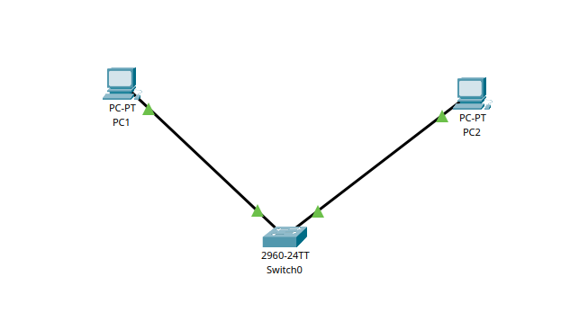
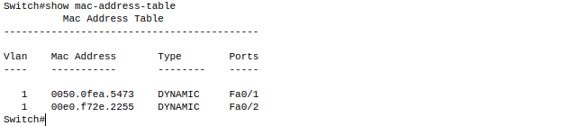

# Заметки к Lab 1

## Топология сети

Создана простая локальная сеть из двух ПК и одного коммутатора. Устройства соединены прямыми кабелями.

## Настройка IP-адресов

На ПК1 и ПК2 вручную назначены IP-адреса:
- ПК1: 192.168.1.2 / 255.255.255.0
- ПК2: 192.168.1.3 / 255.255.255.0

## Проверка связи

Проверил связь между ПК через `ping`. Пакеты успешно доставляются.

Также видно, что в ARP-таблице ПК1 появился MAC-адрес ПК2 после первого запроса.

## MAC-таблица коммутатора

После прохождения трафика, коммутатор заполнил свою MAC-таблицу и запомнил, на каких портах какие устройства.

## Выводы

- Устройства в одной подсети могут общаться напрямую без маршрутизатора.
- ARP используется для определения MAC-адреса получателя.
- Коммутатор обучается MAC-адресам и правильно направляет трафик.
