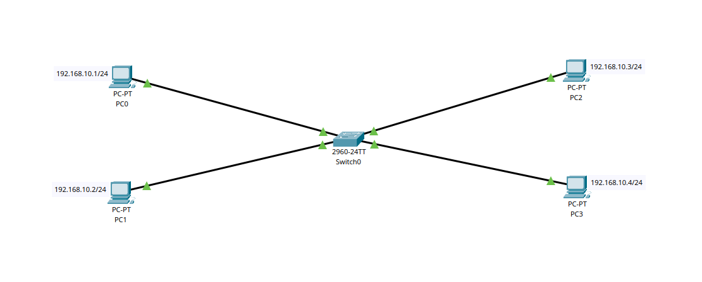
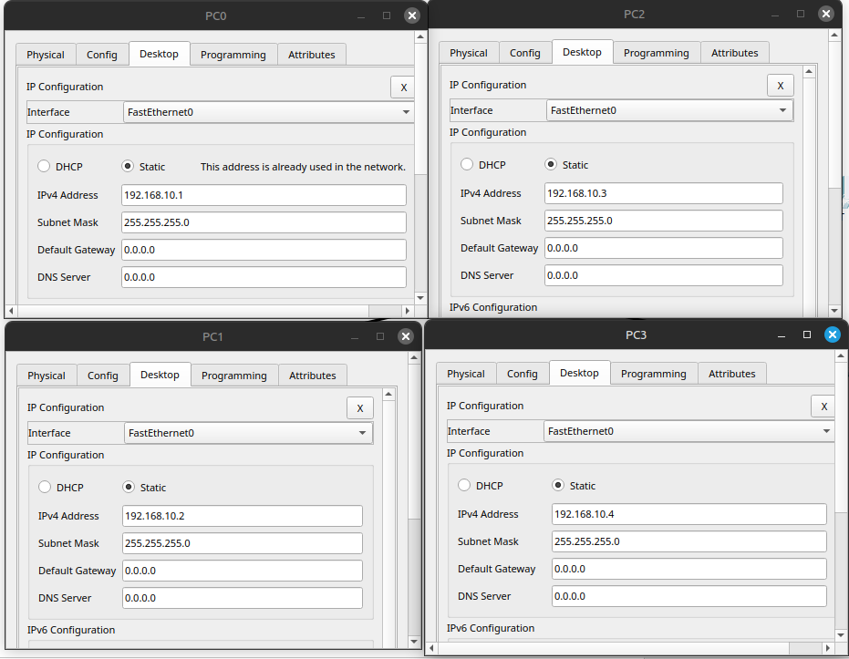
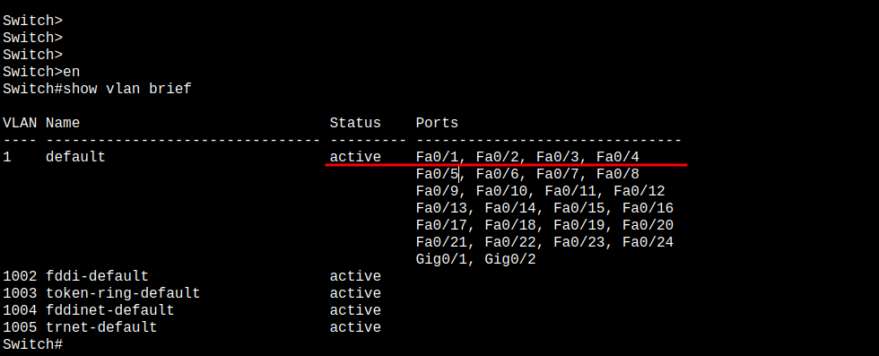
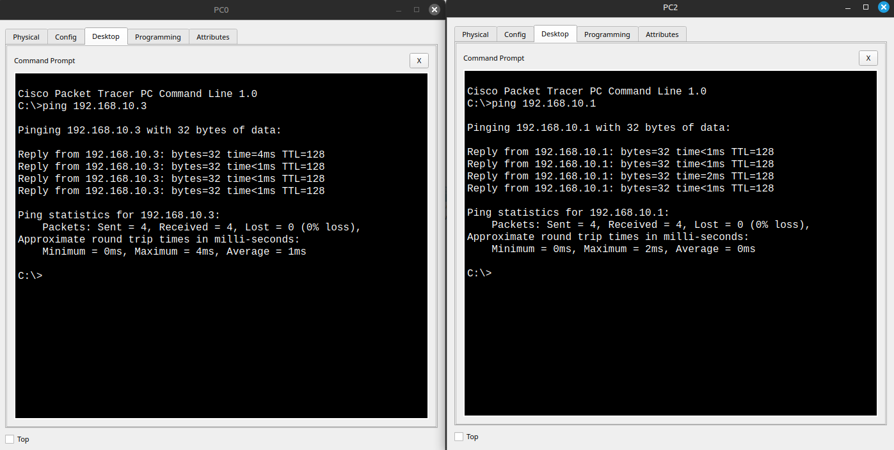
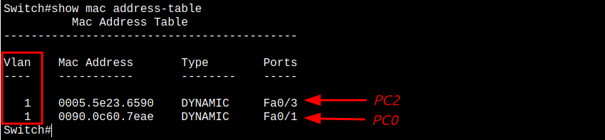
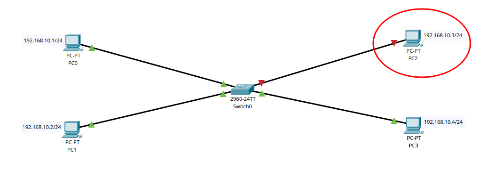
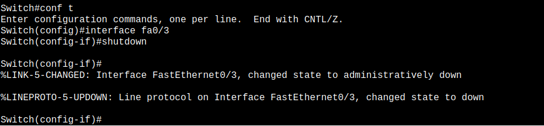
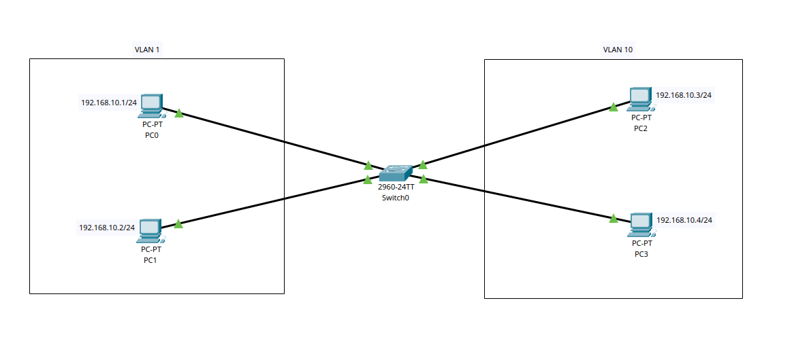

# Lab 1: Базовая коммутация, VLAN, CLI и проверка сетевой связности
    
## ТЗ

Настроить локальную сеть из 4 ПК и коммутатора. Углубиться в работу VLAN, CLI-команд, MAC-таблицы, IP-адресации и проверить связность между хостами. Освоить практические основы коммутации и управления портами.

1. **Подключить 4 ПК к коммутатору по топологии "звезда"**

2. **Назначить каждому ПК IP-адрес из подсети 192.168.10.0/24**
   
    | ПК   | IP-адрес       | Маска подсети     | Шлюз     |
    |------|----------------|-------------------|----------|
    | PC0  | 192.168.10.1   | 255.255.255.0     | —        |
    | PC1  | 192.168.10.2   | 255.255.255.0     | —        |
    | PC2  | 192.168.10.3   | 255.255.255.0     | —        |
    | PC3  | 192.168.10.4   | 255.255.255.0     | —        |
    

3. **Проверить, что все порты находятся в VLAN 1 (по умолчанию)**

4. **Проверить сетевую связность между ПК (ping)**

5. **Посмотреть MAC-таблицу на коммутаторе** 

6. **Отключить один порт и проверить потерю связи**

7. **Создать VLAN 10 с именем Users**

8. **Назначить порты Fa0/3 и Fa0/4 в VLAN 10**

9. **Проверить изоляцию между VLAN**

10. **Настроить имя свича, пароль и баннер**

11. **Сохранить конфигурацию**

* * * 

* * *

## 1. **Подключить 4 ПК к коммутатору по топологии "звезда"**
    


Топология звезда - это когда все ПК подключаются к одному свичу, который находится в центре. Такая схема удобная и надёжная: Централизованная структура, удобна для управления. Если даже один компьютер отключится, остальные продолжают работать без проблем.

--- 

## 2. **Назначить каждому ПК IP-адрес из подсети 192.168.10.0/24**
    


Чтобы ПК могли общаться, им нужны уникальные IP из одной подсети, например 192.168.10.x с маской 255.255.255.0. Если IP повторятся - сеть будет конфликтовать, и соединение не заработает.

С масками чуть сложнее. В реальной жизни, если маски разные, устройства могут "думать" по-разному, кто в сети, а кто нет. Иногда ping будет работать — например, когда один ПК думает, что другой в сети, и наоборот. В Packet Tracer это часто проходит, и кажется, что всё ок. Но на реальном оборудовании и в сложных сетях такие ситуации приводят к проблемам с маршрутизацией и потерей связи.

Поэтому лучше всегда делать маски одинаковыми, чтобы все точно знали - мы в одной сети, и данные передаются без ошибок.

---
 
## 3. **Проверить, что все порты находятся в VLAN 1 (по умолчанию)**
    
   

VLAN 1 - это стандартная виртуальная сеть, которая есть на любом коммутаторе по умолчанию. Когда свитч новый или сброшен, все порты автоматически находятся именно в этой VLAN. Это значит, что все устройства, подключённые к этим портам, могут общаться между собой без дополнительных настроек.

Порты в VLAN 1, можно посмотреть таблицу VLAN на свиче - там видно, какие порты к какой VLAN относятся.

```
Switch> enable  
Switch# show vlan brief
```

---

## 4. **Проверить сетевую связность между ПК (ping)**

   
    
Ping - это простой способ проверить, могут ли компьютеры в сети "видеть" друг друга и обмениваться данными. Отправляем команду ping с одного ПК на другой и смотрим, приходит ли ответ. Если ответ есть - значит связь настроена правильно и устройства в одной сети. Если нет — значит есть проблема с настройками IP, маски или подключением.

---
    
## 5. **Посмотреть MAC-таблицу на коммутаторе** 

   

MAC-таблица - это список, в котором коммутатор хранит адреса устройств (MAC-адреса) и порты, к которым эти устройства подключены. Она помогает свитчу правильно пересылать данные только туда, куда нужно, а не на все порты сразу.

Чтобы проверить таблицу, на коммутаторе используют команду:

```    
Switch# show mac address-table
```

---

## 6. **Отключить один порт и проверить потерю связи**
    


* * *




Чтобы проверить, как сеть реагирует на сбой, можно вручную отключить порт на свиче, к которому подключён один из ПК. После этого пробуем отправить ping с другого ПК - он не должен доходить, так как один из участников сети стал недоступен.

```
Switch(config)# interface fa0/2  
Switch(config-if)# shutdown
```
- Включить порт обратно:
   
```
Switch(config-if)# no shutdown
```
    
---
    
## 7. **Создать VLAN 10 с именем Users**



    - Создать новую VLAN (например, VLAN 10):
    

Switch(config)# vlan 10  
Switch(config-vlan)# name Users

    
    - Назначить порты Fa0/3 и Fa0/4 в VLAN 10:
    

Switch(config)# interface range fa0/3 - 4  
Switch(config-if-range)# switchport mode access  
Switch(config-if-range)# switchport access vlan 10

    
    - Теперь PC2 и PC3 должны быть в другой VLAN и **не видеть** PC0 и PC1 по ping.
    
    ---
    
    ### 8. **Проверка VLAN изоляции**
    
    - Выполнить ping между:
    - PC0 → PC1 (должен работать — VLAN 1)
    - PC2 → PC3 (должен работать — VLAN 10)
    - PC0 → PC2 (не должен работать — разные VLAN)
    
    ---
    
    ### 9. **Сохранение конфигурации**
    
    - Сохранить настройки свича:
    

Switch# write memory

    
    ---
    
    ### 10. **(Дополнительно) Использовать CLI на свиче**
    
    - Задать имя свича:
    

Switch(config)# hostname SW1

    
    - Настроить пароль на привилегированный режим:
    

SW1(config)# enable secret cisco

    
    - Настроить баннер:
    

SW1(config)# banner motd # Доступ только для авторизованных пользователей #

    
    ---
    
    ## Ожидаемый результат
    
    - Сеть работает, базовая топология построена.
    - ПК из одной VLAN пингуются.
    - ПК из разных VLAN — изолированы.
    - CLI-команды освоены.
    - MAC-таблица и VLAN'ы проверены.
    - Схема сохранена и готова к демонстрации.
    
    ---
    
    ## Что заскринить для отчёта/портфолио
    
    - Схема сети с подписями IP и VLAN
    - `ping`-тесты
    - `show vlan brief`
    - `show mac address-table`
    - CLI-конфиг с hostname, banner и VLAN
    
    ---
    
    ## Файлы
    
    - `lab1_switch_vlan_ping.pkt` — файл Packet Tracer
    - `README.md` — этот файл
  
    

* * *

Если хочешь, могу собрать эту лабу тебе в `.pkt` и кинуть список CLI-команд для вставки в Packet Tracer вручную. Хочешь вторую часть — например, добавить роутер, подключить две VLAN через trunk, настроить маршрутизацию между ними или кинуть DHCP-сервер?
