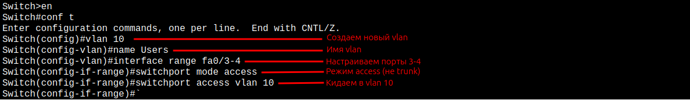
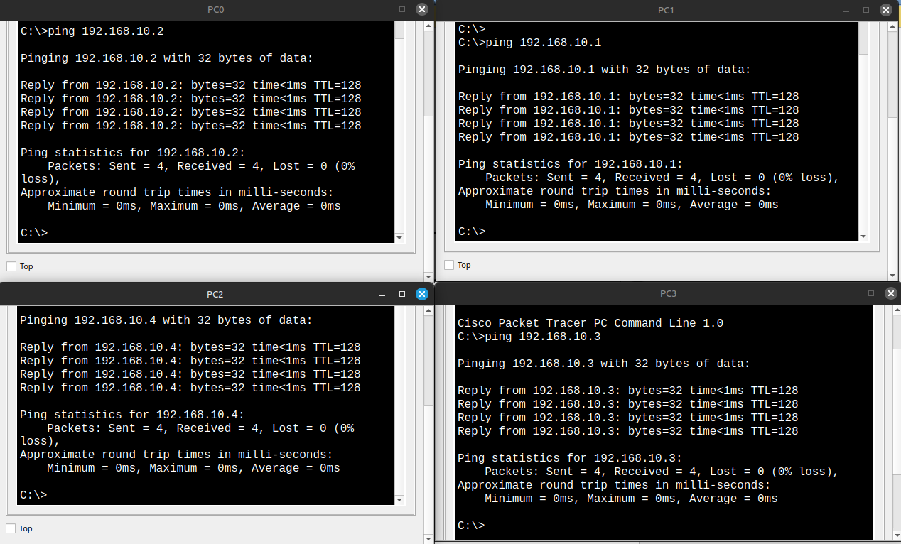
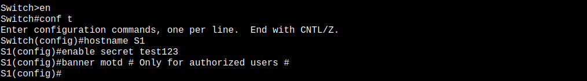
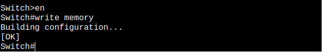

# Lab 1: Базовая коммутация, VLAN, CLI и проверка сетевой связности
    
## ТЗ

Настроить локальную сеть из 4 ПК и коммутатора. Углубиться в работу VLAN, CLI-команд, MAC-таблицы, IP-адресации и проверить связность между хостами. Освоить практические основы коммутации и управления портами.

1. **Подключить 4 ПК к коммутатору по топологии "звезда"**

2. **Назначить каждому ПК IP-адрес из подсети 192.168.10.0/24**
   
    | ПК   | IP-адрес       | Маска подсети     | Шлюз     |
    |------|----------------|-------------------|----------|
    | PC0  | 192.168.10.1   | 255.255.255.0     | —        |
    | PC1  | 192.168.10.2   | 255.255.255.0     | —        |
    | PC2  | 192.168.10.3   | 255.255.255.0     | —        |
    | PC3  | 192.168.10.4   | 255.255.255.0     | —        |
    

3. **Проверить, что все порты находятся в VLAN 1 (по умолчанию)**

4. **Проверить сетевую связность между ПК (ping)**

5. **Посмотреть MAC-таблицу на коммутаторе** 

6. **Отключить один порт и проверить потерю связи**

7. **Создать VLAN 10 с именем Users. Назначить порты Fa0/3 и Fa0/4 в VLAN 10**

8. **Проверить изоляцию между VLAN**

9. **Настроить имя свича, пароль и баннер**

10. **Сохранить конфигурацию**

* * * 

* * *

## 1. **Подключить 4 ПК к коммутатору по топологии "звезда"**
    


Топология звезда - это когда все ПК подключаются к одному свичу, который находится в центре. Такая схема удобная и надёжная: Централизованная структура, удобна для управления. Если даже один компьютер отключится, остальные продолжают работать без проблем.

--- 

## 2. **Назначить каждому ПК IP-адрес из подсети 192.168.10.0/24**
    


Чтобы ПК могли общаться, им нужны уникальные IP из одной подсети, например 192.168.10.x с маской 255.255.255.0. Если IP повторятся - сеть будет конфликтовать, и соединение не заработает.

С масками чуть сложнее. В реальной жизни, если маски разные, устройства могут "думать" по-разному, кто в сети, а кто нет. Иногда ping будет работать — например, когда один ПК думает, что другой в сети, и наоборот. В Packet Tracer это часто проходит, и кажется, что всё ок. Но на реальном оборудовании и в сложных сетях такие ситуации приводят к проблемам с маршрутизацией и потерей связи.

Поэтому лучше всегда делать маски одинаковыми, чтобы все точно знали - мы в одной сети, и данные передаются без ошибок.

---
 
## 3. **Проверить, что все порты находятся в VLAN 1 (по умолчанию)**
    
   

VLAN 1 - это стандартная виртуальная сеть, которая есть на любом коммутаторе по умолчанию. Когда свитч новый или сброшен, все порты автоматически находятся именно в этой VLAN. Это значит, что все устройства, подключённые к этим портам, могут общаться между собой без дополнительных настроек.

Порты в VLAN 1, можно посмотреть таблицу VLAN на свиче - там видно, какие порты к какой VLAN относятся.

```
Switch> enable  
Switch# show vlan brief
```

---

## 4. **Проверить сетевую связность между ПК (ping)**

   
    
Ping - это простой способ проверить, могут ли компьютеры в сети "видеть" друг друга и обмениваться данными. Отправляем команду ping с одного ПК на другой и смотрим, приходит ли ответ. Если ответ есть - значит связь настроена правильно и устройства в одной сети. Если нет — значит есть проблема с настройками IP, маски или подключением.

---
    
## 5. **Посмотреть MAC-таблицу на коммутаторе** 

   

MAC-таблица - это список, в котором коммутатор хранит адреса устройств (MAC-адреса) и порты, к которым эти устройства подключены. Она помогает свитчу правильно пересылать данные только туда, куда нужно, а не на все порты сразу.

Чтобы проверить таблицу, на коммутаторе используют команду:

```    
Switch# show mac address-table
```

---

## 6. **Отключить один порт и проверить потерю связи**
    


* * *


Чтобы проверить, как сеть реагирует на сбой, можно вручную отключить порт на свиче, к которому подключён один из ПК. После этого пробуем отправить ping с другого ПК - он не должен доходить, так как один из участников сети стал недоступен.

```
Switch(config)# interface fa0/3  
Switch(config-if)# shutdown
```
- Включить порт обратно:
   
```
Switch(config-if)# no shutdown
```
    
---
    
## 7. **Создать VLAN 10 с именем Users**


VLAN позволяет логически разделять устройства в пределах одного коммутатора. Даже если всё подключено к одному свичу, устройства из разных VLAN не смогут напрямую общаться друг с другом. Это удобно для изоляции отделов или повышения безопасности.

Создаём новую VLAN с номером 10 и даём ей имя Users - это просто для удобства, чтобы было понятно, зачем она. После создания в неё можно добавлять нужные порты. В нашем случае - это fa0/3 и fa0/4, к которым подключены PC2 и PC3. Когда мы переводим эти порты в VLAN 10, устройства на них (то есть PC2 и PC3) оказываются в отдельной виртуальной сети и не смогут общаться с теми, кто остался в VLAN 1. 


    
```
Switch(config)# vlan 10  
Switch(config-vlan)# name Users
Switch(config)# interface range fa0/3 - 4  
Switch(config-if-range)# switchport mode access  
Switch(config-if-range)# switchport access vlan 10
```

---
    
## 8. **Проверить изоляцию между VLAN**



Чтобы убедиться, что VLAN работают правильно, нужно проверить, кто с кем может общаться. В нашем случае:

- PC2 и PC3 находятся в VLAN 10, пинг между ними проходит
- PC0 и PC1 в VLAN 1, пинг между ними тоже проходит


А вот пинг между VLAN (с PC0 на PC3) не проходит, и это как раз нормально. Так и должно быть: устройства из разных VLAN по умолчанию изолированы друг от друга.

---
    
## 9. **Настроить имя свича, пароль и баннер**
    

Для базовой настройки коммутатора обычно задают имя, ставят пароль на доступ в режим настройки и добавляют баннер-предупреждение. Это полезно даже в простых лабах — помогает ориентироваться и выглядит как нормальная админская практика.

В моем случае я настроил следующее:

```
Switch(config)# hostname S1
S1(config)# enable secret test123
S1(config)# banner motd # Only for authorized users! #
```

Теперь при входе через консоль или telnet, перед тем как попасть в режим настройки, нужно ввести установленный пароль, и сразу появляется предупреждение.

---

## 10. **Сохранить конфигурацию**



После всех настроек важно сохранить конфигурацию, чтобы она не сбросилась после перезагрузки свича. В Cisco для этого используется команда:
```
S1# write memory
```
или
```
S1# copy running-config startup-config
```

Обе команды делают одно и то же — сохраняют текущие настройки (running-config) в постоянную память (startup-config). Если не сохранить, после перезапуска свич вернётся к заводским настройкам, и всё придётся делать заново.

---
    
## Ожидаемый результат
    
- Сеть работает, базовая топология построена.
- ПК из одной VLAN пингуются.
- ПК из разных VLAN - изолированы.
- MAC-таблица и VLAN проверены.
- Схема сохранена и готова
    
---

    
## Файлы
    
- `lab1_switch_vlan_ping.pkt` - файл Packet Tracer
- `screenshots` - скрины
- `README.md` - этот файл
