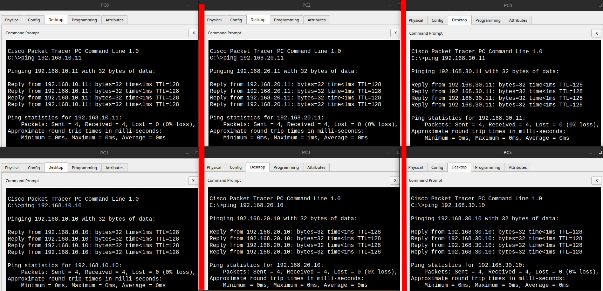

# Lab 2: Базовая настройка маршрутизатора и интерфейсов
    
## ТЗ

Настроить маршрутизатора Cisco с тремя подсетями, подключенными через коммутаторы. Каждая подсеть изолирована, но все они объединяются через маршрутизатор.

### 1. Создать топологию из:
- Маршрутизатора Cisco (R1)
- Трёх коммутаторов (SW1, SW2, SW3)
- По 2 ПК в каждой подсети 

### 2. Сформировать следующие подсети:
- 192.168.10.0/24
- 192.168.20.0/24
- 192.168.30.0/24

### 3. Изменить имя маршрутизатора и назначить IP-адреса интерфейсам маршрутизатора:
- g0/0 → 192.168.10.1/24
- g0/1 → 192.168.20.1/24
- g0/2 → 192.168.30.1/24

### 4. Настроить вручную IP-адреса на всех ПК согласно подсетям:
- ПК из первой подсети: IP из диапазона 192.168.10.x, шлюз 192.168.10.1
- ПК из второй подсети: IP из диапазона 192.168.20.x, шлюз 192.168.20.1
- ПК из третьей подсети: IP из диапазона 192.168.30.x, шлюз 192.168.30.1

### 5. Проверить связность внутри каждой подсети (ping между ПК одной сети)

### 6. Проверить межсетевую связность через маршрутизатор

### 7. Просмотреть таблицу маршрутизации на R1:

### 8. Настроить базовую защиту:
- Пароль на привилегированный режим (enable secret)
- Пароль на консольный доступ
- Баннер предупреждения при входе

### 9. Сохранить конфигурацию

* * * 

* * *

## 1. Создать топологию из: Маршрутизатора, трёх коммутаторов, по 2 ПК в каждой подсети 
    


Маршрутизатор — это устройство, которое соединяет разные сети и обеспечивает обмен данными между ними. Он принимает пакеты и направляет их в нужную сеть, основываясь на IP-адресах. Благодаря маршрутизатору устройства из разных подсетей могут обмениваться информацией.

Маршрутизация — это процесс выбора пути для передачи данных между сетями. Маршрутизатор использует таблицы маршрутизации, чтобы определить, куда отправить пакет, чтобы он достиг нужного получателя. Это может быть статический маршрут(настроенный вручную), или динамический(с помощью специальных протоколов).

Коммутатор - это устройство, которое объединяет устройства внутри одной локальной сети. Он работает с MAC-адресами и направляет данные только тому устройству, к которому они предназначены. Это позволяет уменьшить нагрузку в сети и повысить ее эффективность.

--- 

## 2. Сформировать следующие подсети: 192.168.10.0/24; 192.168.20.0/24; 192.168.30.0/24;
    
Подсеть - это часть общей сети, которая разделяется по определенным правилам. Каждая подсеть имеет свой диапазон IP-адресов. Разделение на подсети помогает организовать сеть, повысить безопасность и упростить управление.

В IP-сетях подсеть определяется маской подсети. Маска указывает, какая часть IP-адреса относится к сети, а какая - к устройствам внутри нее.

Пример:
- Сеть: 192.168.10.0/24
- Маска подсети: 255.255.255.0

Здесь /24 означает, что первые 24 бита - это адрес сети, а оставшиеся 8 бит - для адресов устройств. В такой подсети можно использовать до 254 устройств (адреса от 192.168.10.1 до 192.168.10.254).

Аналогично:
- 192.168.20.0/24 — отдельная подсеть
- 192.168.30.0/24 — ещё одна подсеть

Устройства из разных подсетей напрямую друг друга не видят, для связи между ними нужен маршрутизатор.

---
 
## 3. Изменить имя маршрутизатора и назначить IP-адреса интерфейсам маршрутизатора

   

По умолчанию все устройства Cisco называются просто Router или Switch, что неудобно, особенно когда устройств несколько. Чтобы избежать путаницы, лучше сразу задать понятное имя устройству.

```
Router(config)# hostname R1
```

* * *

   

Чтобы маршрутизатор мог "понимать", какие сети к нему подключены, каждому его интерфейсу нужно выдать IP-адрес из соответствующей подсети. Этот адрес станет "точкой выхода" для устройств из этой подсети.

Например:
- Интерфейс G0/0 — сеть 192.168.10.0/24, IP-адрес 192.168.10.1
- Интерфейс G0/1 — сеть 192.168.20.0/24, IP-адрес 192.168.20.1
- Интерфейс G0/2 — сеть 192.168.30.0/24, IP-адрес 192.168.30.1

Эти адреса обычно назначаются именно .1 - это стандартная практика, чтобы маршрутизатор был первым устройством в подсети по адресу.

После назначения IP-адресов нужно включить интерфейсы командой no shutdown, иначе они будут выключены по умолчанию.

```
R1(config)# interface g0/0
R1(config-if)# description Сеть 192.168.10.0/24
R1(config-if)# ip address 192.168.10.1 255.255.255.0
R1(config-if)# no shutdown
```

---

## 4. Настроить вручную IP-адреса на всех ПК согласно подсетям

   
    
Шлюз - это адрес устройства, через которое ПК выходит в другие сети. Обычно это IP самого маршрутизатора внутри подсети.

Пример:
Если ПК в сети 192.168.10.0/24, то:
- IP ПК — 192.168.10.2
- Маска — 255.255.255.0
- Шлюз — 192.168.10.1 (IP порта маршрутизатора)

Без шлюза ПК сможет общаться только внутри своей сети. Чтобы достучаться до других сетей нужен правильно настроенный шлюз.

---
    
## 5. Проверить связность внутри каждой подсети (ping между ПК одной сети)

   

Необходимо убедиться, что устройства в одной подсети могут обмениваться данными. Для этого выполняется команда ping между ПК внутри одной сети. Если отклик есть - подключение и IP-настройка выполнены верно.

---

## 6. Проверить межсетевую связность через маршрутизатор
    


* * *


Проверить, что ПК из разных подсетей могут обмениваться данными через маршрутизатор. Для этого выполняется команда ping с одного ПК на другой из другой подсети. Успешный отклик подтверждает корректную маршрутизацию между подсетями и правильную настройку интерфейсов маршрутизатора.

---
    
## 7. Просмотреть таблицу маршрутизации на R1


Таблица маршрутизации - это список, где маршрутизатор хранит информацию о том, куда отправлять пакеты для разных сетей. Она помогает ему выбирать правильный путь, чтобы данные дошли до нужного устройства. Посмотреть эту таблицу можно командой show ip route. Это важно, чтобы убедиться, что маршрутизатор знает, как добраться до всех подсетей и внешних сетей.

    
## 8. Настроить базовую защиту


Настроена базовая защита маршрутизатора: установлен пароль для консольного доступа - это вход через локальный интерфейс управления, который предотвращает несанкционированное подключение. Для привилегированного режима задан отдельный секретный пароль, обеспечивающий дополнительный уровень безопасности при выполнении важных команд настройки. Также настроен баннер с предупреждающим сообщением - он выводится при входе и служит официальным уведомлением для пользователей, напоминающим о правилах и ответственности за доступ к устройству.

* * *


---

## 10. Сохранить конфигурацию


После всех настроек важно сохранить конфигурацию, чтобы она не сбросилась после перезагрузки. В Cisco для этого используется команда:
```
R1# write memory
```
или
```
R1# copy running-config startup-config
```

Обе команды делают одно и то же - сохраняют текущие настройки (running-config) в постоянную память (startup-config). Если не сохранить, после перезапуска устройство вернется к заводским настройкам.

---
    
## Ожидаемый результат
    
- Топология с маршрутизатором, коммутаторами и ПК корректно создана.
- Интерфейсы маршрутизатора и ПК настроены с правильными IP-адресами.
- ПК внутри каждой подсети успешно пингуются друг с другом.
- Межсетевой пинг между подсетями проходит через маршрутизатор.
- Таблица маршрутизации на маршрутизаторе отображает корректные маршруты.
- Базовая защита настроена: установлен пароль на консоль, включен привилегированный режим, добавлен баннер.
- Конфигурация маршрутизатора сохранена и сохранена для повторного использования.
    
---

    
## Файлы
    
- `lab2_router_ip_setup.pkt` - файл Packet Tracer
- `screenshots` - скрины
- `README.md` - этот файл
