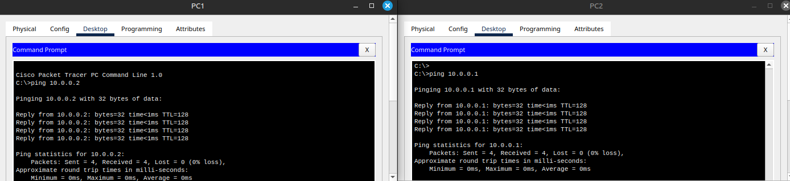

# Заметки к Lab 5 - Прямая связь между двумя ПК

## Схема подключения

- ПК1 и ПК2 соединены напрямую кроссовым кабелем.
- Нет коммутаторов или маршрутизаторов.

## Настройка IP-адресов

- ПК1: 10.0.0.1 / 255.255.255.0  
- ПК2: 10.0.0.2 / 255.255.255.0  

## Проверка связи

- Выполнен `ping` с ПК1 на ПК2 — пакеты успешно доставлены.

## Выводы

- Прямая связь между двумя ПК возможна без коммутатора при использовании кроссового кабеля.
- IP-адреса должны быть в одной подсети. Почему ? Потому что, протокол IP использует маску подсети, чтобы определить, находятся ли два адреса в одной локальной сети.
- При правильной настройке связь устанавливается без дополнительных устройств.
