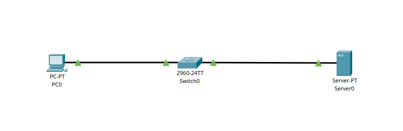
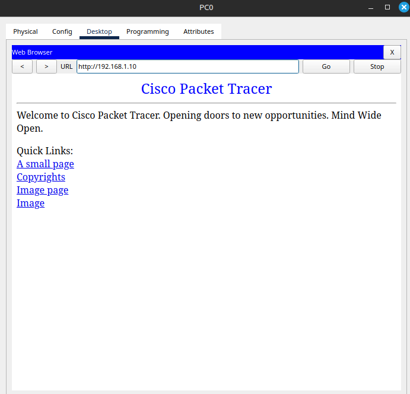

# Заметки к Lab 6 — Подключение к серверу

## Что сделано

- Соединил ПК1 и сервер через коммутатор.
- Назначил IP-адреса:
  - ПК1: 192.168.1.2 / 255.255.255.0
  - Сервер: 192.168.1.10 / 255.255.255.0
- На сервере включил службу HTTP (вкладка Services > HTTP).
- На ПК1 открыл браузер и перешёл по адресу: `http://192.168.1.10`.

## Что проверено

- Страница сервера загрузилась в браузере — соединение установлено.
- Также выполнил `ping` до сервера — пакеты доставлены.

## Выводы

- Доступ к сайту внутри локальной сети не требует маршрутизатора, если все устройства в одной подсети.
- Веб-сервер должен быть включён (служба HTTP активна).
- DNS не требуется — можно обращаться по IP-адресу напрямую.
