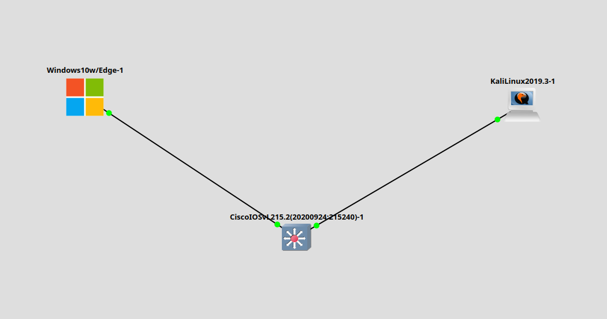

# Заметки к Lab 1 — GNS3 (Switch + Windows 10 + Kali Linux)

## Что сделано:
- Развернул топологию в GNS3: Windows 10 и Kali Linux соединены через Cisco IOSv L2 Switch.
- Подключил:
  - Windows 10 → FastEthernet0/1
  - Kali Linux → FastEthernet0/2

- Назначил статические IP:
  - Windows 10: `192.168.1.2/24`
  - Kali Linux: `192.168.1.3/24`
- Проверил соединение:
  - Сначала `ping` с Kali на Windows не проходил.
  - Проблема оказалась в настройках Windows — были отключены входящие ICMP (ping).
  - Включил сетевое обнаружение (network discovery) и разрешил ICMP во входящих правилах брандмауэра.
  - После этого `ping` заработал.

## Что изучено:
- Коммутатор L2 корректно передаёт трафик между портами.
- Для работы ping между хостами:
  - IP-адреса должны быть в одной подсети.
  - ICMP-запросы должны быть разрешены в фаерволе.
- Windows может по умолчанию блокировать входящий ICMP (ping), что надо учитывать при отладке.

## Что можно дополнительно:
- Использовать Wireshark для анализа, проходят ли ICMP-запросы и где они теряются.
- Проверить MAC-таблицу коммутатора (`show mac address-table`).
- Добавить маршрутизатор и протестировать выход в другую подсеть.
