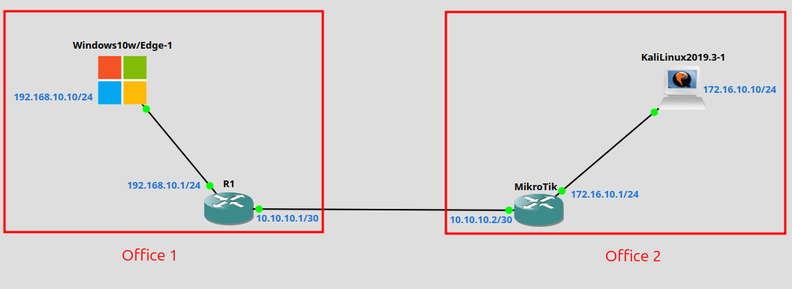
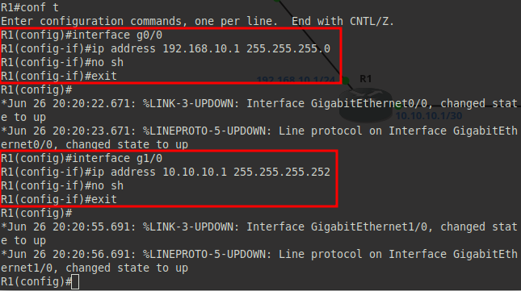
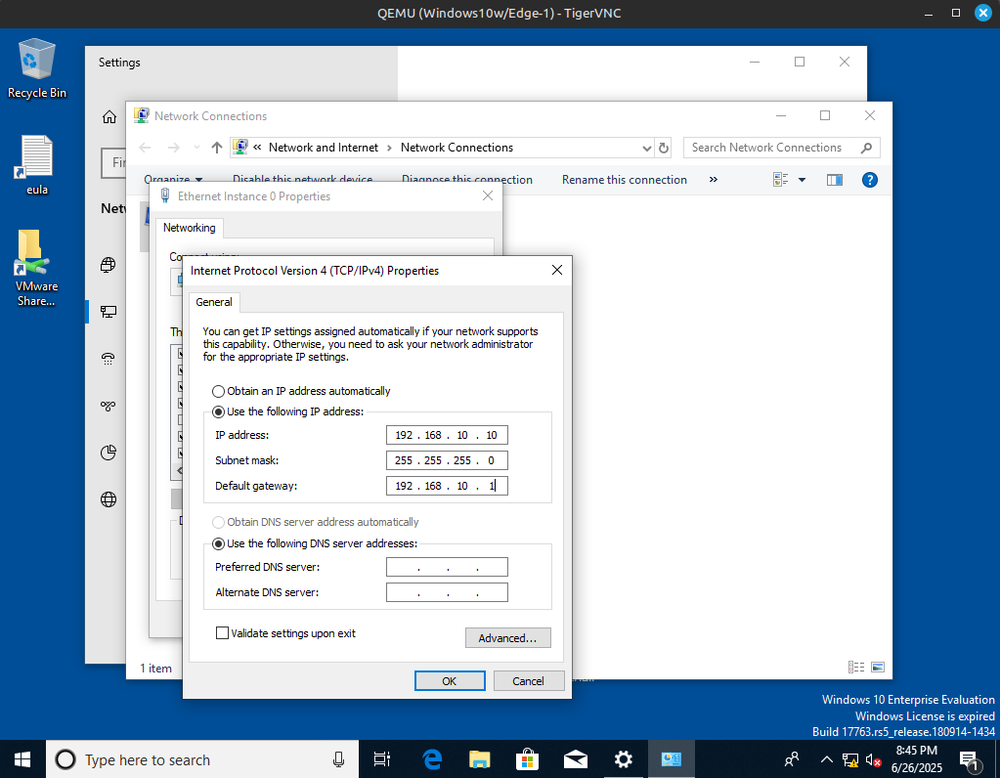
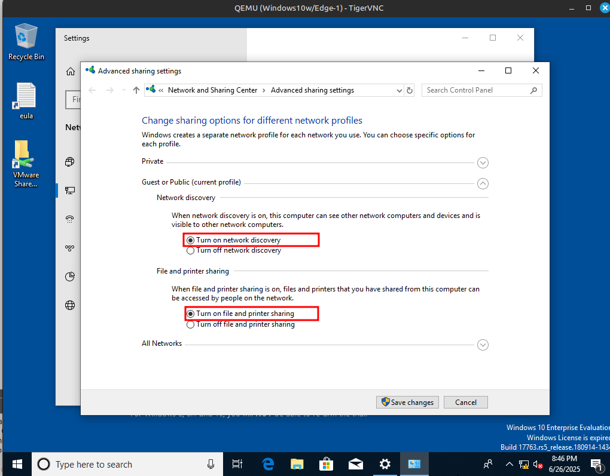
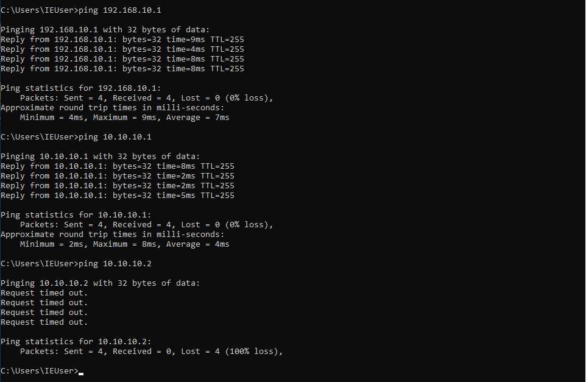
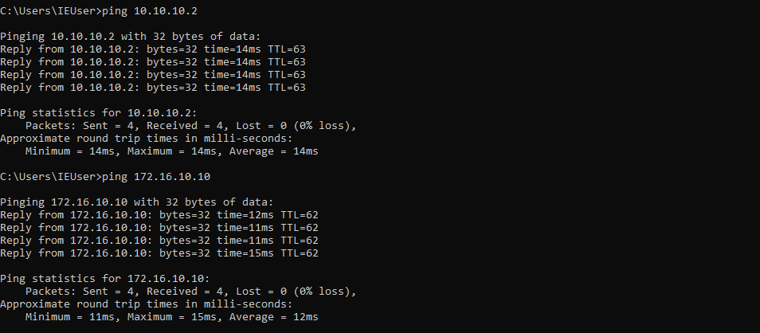
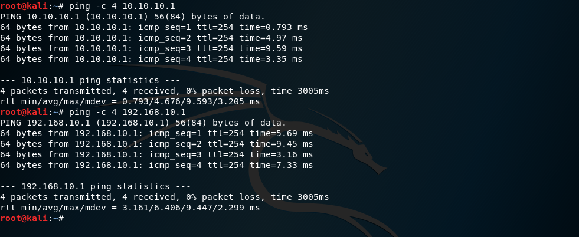
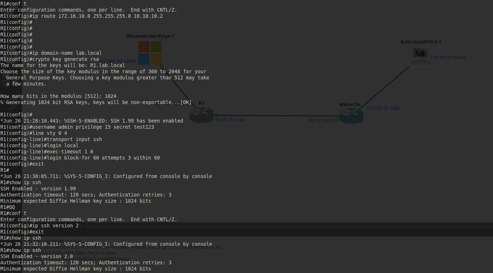
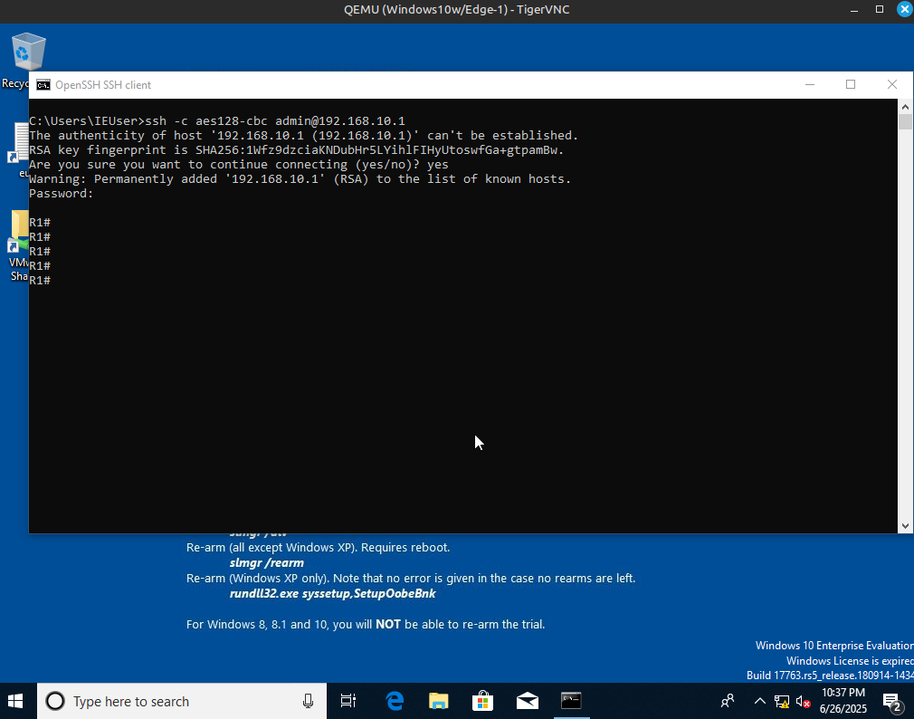
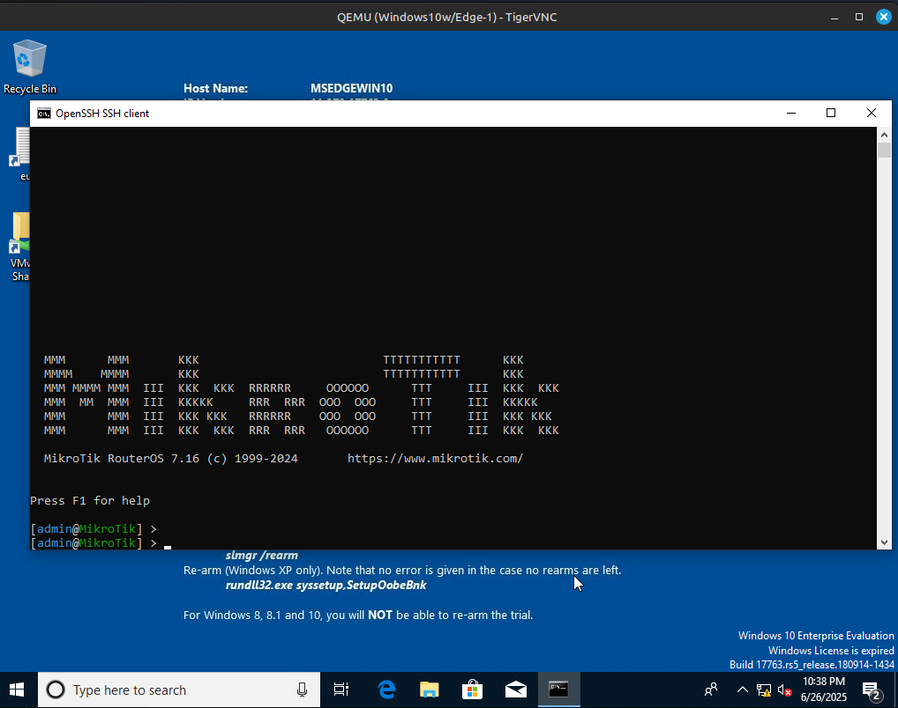

# Настройка межсетевого SSH-доступа в мультисегментной сети Cisco и MikroTik с использованием GNS3

## ТЗ
Построить и настроить сеть из двух офисов с маршрутизаторами Cisco и MikroTik, используя операционные системы: Windows 10 и Kali Linux. Настроить IP-адресацию, маршрутизацию и SSH-доступ с ограничением по IP. Проверить связность и удалённое подключение.

#### 1. Построить топологию сети:
- Office 1: Windows 10 (192.168.10.10/24) подключён к Cisco R1 (192.168.10.1/24)
- Office 2: Kali Linux (172.16.10.10/24) подключён к MikroTik R2 (172.16.10.1/24)
- Между Cisco и MikroTik установить линк (10.10.10.0/30)

#### 2. Настроить IP-адреса на Cisco R1:
- Интерфейс к Windows 10: 192.168.10.1/24
- Интерфейс к MikroTik: 10.10.10.1/30

#### 3. Настроить IP-адреса на MikroTik R2:
- Интерфейс к Kali Linux: 172.16.10.1/24
- Интерфейс к Cisco: 10.10.10.2/30

#### 4. Назначить IP-адреса Windows 10 и Kali Linux в соответствующих подсетях

#### 5. Проверить локальную связность (ping) внутри Office 1 и Office 2

#### 6. Настроить маршрутизацию на Cisco и MikroTik для обеспечения связи между подсетями офисов

#### 7. Проверить межсетевую связность (ping) между Windows 10 и Kali Linux

#### 8. Настроить SSH на Cisco

#### 9. Настроить SSH на Mikrotik

#### 10. С помощью SSH подключиться с Windows 10 к Cisco и MikroTik, а также с Kali Linux к Cisco и MikroTik

#### 11. На MikroTik разрешить SSH-подключение только с Kali Linux (172.16.10.10), остальные IP заблокировать

* * * 

> Полный список команд для настройки Cisco, MikroTik и ПК, с краткими комментариями к каждой команде в файле .

* * *

### 1. Построить топологию



Топология следующая: в первом офисе клиент Windows 10 подключается напрямую к интерфейсу G0/0 маршрутизатора Cisco, а сам маршрутизатор Cisco своим интерфейсом G1/0 соединяется с MikroTik по выделённой магистрали, эмулируя связь между двумя разными сегментами сети. С другой стороны MikroTik подключен ко второму офису, где находится Kali Linux.

В дальнейших шагах будет настроена IP-адресация: Windows получит адрес 192.168.10.10, а Cisco — 192.168.10.1 в подсети 192.168.10.0/24, которая используется в первом офисе. Для связи между маршрутизаторами в сети 10.10.10.0/30 будут назначены адреса 10.10.10.1 у Cisco и 10.10.10.2 у MikroTik. Во втором офисе планируется использовать подсеть 172.16.10.0/24, где MikroTik получит адрес 172.16.10.1, а Kali Linux — 172.16.10.10.

* * *

### 2. Настроить IP-адреса на Cisco R1



После сборки топологии следующим этапом является настройка IP-адресов на маршрутизаторе Cisco, чтобы обеспечить работу локальной сети первого офиса и соединение между офисами. В нашей схеме маршрутизатор Cisco имеет два интерфейса — первый интерфейс G0/0 подключён к локальной сети, где находится клиент Windows 10, а второй интерфейс G0/1 используется для связи с маршрутизатором MikroTik, который находится во втором офисе. Таким образом, Cisco выполняет роль шлюза для устройств внутри первого офиса и одновременно обеспечивает межсетевое соединение.

Для локальной сети офиса мы используем подсеть 192.168.10.0/24, что даёт нам 256 возможных адресов, из которых 254 доступны для использования устройствами. Маска подсети 255.255.255.0 (или префикс /24) указывает, что первые 24 бита адреса — это часть сети, а оставшиеся 8 бит — для адресации устройств. В такой схеме адрес 192.168.10.0 является сетевым, то есть служебным и не назначается устройствам, а адрес 192.168.10.255 является широковещательным (broadcast) — его используют для отправки пакетов сразу всем участникам сети.

Поэтому для маршрутизатора Cisco на интерфейсе G0/0 мы назначаем адрес 192.168.10.1 — это удобное и привычное решение, когда именно первый доступный адрес отдают шлюзу. Этот адрес будет использоваться в качестве точки выхода из сети для всех устройств локального сегмента, включая клиентский компьютер с Windows 10, который в дальнейшем получит адрес 192.168.10.10.

Следующий интерфейс G0/1 маршрутизатора Cisco предназначен для соединения с MikroTik. Здесь мы используем сеть 10.10.10.0/30. Маска 255.255.255.252 (или префикс /30) позволяет создать очень компактную сеть из четырёх адресов. Это типичная практика для соединения "точка-точка", когда требуется минимизировать расход IP-адресов, поскольку такой линк соединяет только два устройства — роутеры Cisco и MikroTik. В этой подсети:

- 10.10.10.0 - сетевой адрес (служебный, не используется).
- 10.10.10.1 - адрес Cisco.
- 10.10.10.2 - адрес MikroTik.
- 10.10.10.3 - широковещательный адрес.

Использование сети /30 подходит для соединения двух устройств напрямую, обеспечивая экономию адресного пространства и упрощая конфигурацию.

В результате маршрутизатор Cisco получает два адреса:

- На интерфейсе G0/0 - 192.168.10.1 для взаимодействия с локальной сетью.
- На интерфейсе G0/1 - 10.10.10.1 для связи с MikroTik.

* * *

### 3. Настроить IP-адреса на MikroTik R2


При первом запуске MikroTik RouterOS через консоль (например, в GNS3) устройство запрашивает логин и пароль для входа. По умолчанию логин - **admin**, а пароль отсутствует (просто нажимаем Enter). Однако при первой настройке система обязательно требует задать новый пароль, так как пустой пароль оставить нельзя - это связано с тем, что новый пароль не может совпадать с текущим (пустым) для безопасности доступа. Поэтому при вводе пустого пароля появится ошибка, и потребуется ввести пароль для последующего входа.

Далее мы приступаем к назначению IP-адресов на интерфейсы MikroTik, что необходимо для правильной работы сети и межсетевого взаимодействия.

В нашей топологии MikroTik имеет два интерфейса:

- Интерфейс, соединённый с Cisco (внутренний линк) - IP из сети 10.10.10.0/30
- Интерфейс, подключённый ко второму офису (локальная сеть) - IP из сети 172.16.10.0/24

Для удобства работы и лучшей читаемости конфигурации я переименовал интерфейсы MikroTik (ether1, ether2 и т.д.) в более понятные имена, соответствующие их назначению, *To_Cisco*, *To_Kali* .

* * * 

### 4. Назначить IP-адреса Windows 10 и Kali Linux в соответствующих подсетях

#### Windows 10



Назначаем IP-адреса на клиентских машинах - Windows 10 и Kali Linux, чтобы они могли корректно взаимодействовать с роутерами и друг с другом внутри своих подсетей.

В Windows 10 это делается через настройки сетевого адаптера. Нужно открыть «Центр управления сетями и общим доступом», выбрать активное подключение, перейти в «Свойства», затем выбрать «Протокол Интернета версии 4 (TCP/IPv4)» и нажать «Свойства». Здесь вручную прописывается IP-адрес, маска подсети и шлюз по умолчанию. Например, для первого офиса это будет IP 192.168.10.10 с маской 255.255.255.0 и шлюзом 192.168.10.1 (адрес Cisco).



Кроме того, в Windows 10 стоит обратить внимание на настройки брандмауэра и параметры общего доступа (Share Options). По умолчанию, чтобы повысить безопасность, система блокирует входящие ICMP-запросы (ping) и некоторые виды трафика. Чтобы пинг с других устройств успешно проходил, необходимо либо временно отключить брандмауэр, либо настроить правила для разрешения входящих ping-запросов и других нужных протоколов. Без этой настройки пинг может просто не доходить до Windows, несмотря на правильные IP и маршруты.

----

#### Kali Linux


В Kali Linux IP-адрес назначается через терминал командой ip addr add, например: sudo ip addr add 172.16.10.10/24 dev eth0, где 172.16.10.10 — IP-адрес, /24 — маска подсети, а eth0 — имя сетевого интерфейса. Для настройки шлюза по умолчанию используется команда sudo ip route add default via 172.16.10.1.

Ручное назначение IP-адресов необходимо, так как автоматическое получение IP (DHCP-серверы) в нашей топологии отсутствует, что помогает лучше разобраться с основами IP-адресации и как устройства общаются в сети.

* * *

### 5. Проверить локальную связность (ping) внутри Office 1 и Office 2

#### На Windows 10 (Office 1)



Для проверки правильности настройки IP-адресов и базовой сетевой связности внутри каждого офиса мы используем команду ping с рабочих станций — Windows 10 в Office 1 и Kali Linux в Office 2. Ping — это простой инструмент, позволяющий проверить, достигает ли отправляемый пакет целевого устройства и получает ли ответ.

Начинаем с Office 1: с Windows 10 выполняем ping адреса интерфейса Cisco маршрутизатора в подсети 192.168.10.0/24, например 192.168.10.1. Как видно на скриншоте, ping проходит успешно, поскольку оба устройства находятся в одной подсети, и маршрутизатор отвечает на запросы. Это подтверждает, что IP-адреса назначены корректно и физическое соединение работает.

Также с Windows 10 выполняем ping на адрес 10.10.10.1 - локальный интерфейс Cisco в канале между роутерами. Этот ping успешно проходит, и ответ приходит, так как этот IP напрямую принадлежит Cisco и находится в его интерфейсе. Cisco может корректно обработать пакет и отправить ответ, поскольку устройство знает о своих локальных интерфейсах и соответствующих сетях.

Далее с Windows 10 пробуем отправить ping на адрес 10.10.10.2 — это IP интерфейса MikroTik на канале точка-точка между роутерами. Запрос покидает локальную подсеть и доходит до MikroTik, однако ответа не приходит. Это происходит потому, что MikroTik не знает, как вернуть ответ обратно в сеть Windows, поскольку маршрутизация между роутерами ещё не настроена. Без маршрута обратно пакеты с MikroTik не доходят до Windows, и ping не получает ответа.

---

#### На Kali Linux (Office 2)


Аналогичная проверка на стороне Office 2 проводится с Kali Linux, где также выполняем ping на IP MikroTik 172.16.10.1 — он успешно проходит, подтверждая корректность настройки локальной сети второго офиса. Таким образом, мы видим, что локальная связность внутри каждого офиса функционирует корректно, а для межсетевого взаимодействия требуется дополнительная настройка маршрутизации.

* * *

### 6. Настроить маршрутизацию на Cisco и MikroTik для обеспечения связи между подсетями офисов

#### На Cisco


Для того чтобы устройства из разных подсетей смогли обмениваться данными, необходимо настроить маршрутизацию на обоих маршрутизаторах — Cisco и MikroTik. Без неё пакеты, отправленные из одной подсети, не смогут правильно добраться до другой, так как устройства просто не знают, куда пересылать трафик за пределами своей локальной сети.

В нашем случае есть три подсети: 192.168.10.0/24 (Office 1), 10.10.10.0/30 (канал между маршрутизаторами) и 172.16.10.0/24 (Office 2). Каждый маршрутизатор знает о своих локальных сетях, но чтобы обеспечить связь между офисами, нужно добавить статические маршруты, которые укажут, куда отправлять пакеты для другой подсети.

На Cisco мы настроим маршрут к сети 172.16.10.0/24 через следующий хоп — интерфейс MikroTik с IP 10.10.10.2. Это скажет Cisco, что для доставки пакетов в офис 2 нужно отправлять трафик через линк с MikroTik. Команда: ```ip route 172.16.10.0 255.255.255.0 10.10.10.2```

---

#### На Mikrotik


Аналогично, на MikroTik нужно добавить маршрут к сети 192.168.10.0/24 через Cisco — IP 10.10.10.1. Это позволит MikroTik пересылать пакеты в офис 1, направляя их на Cisco:
```/ip route add dst-address=192.168.10.0/24 gateway=10.10.10.1```

После добавления маршрутов оба маршрутизатора будут знать, как доставлять пакеты между сетями офисов. Теперь, когда Windows в Office 1 отправляет пакеты на Kali в Office 2, они проходят через Cisco, затем по точка-точка каналу к MikroTik и далее в локальную сеть второго офиса. И наоборот, пакеты от Kali к Windows идут по обратному пути.

Важно отметить, что статические маршруты — это простой и надёжный способ в небольших сетях. В более крупных и динамичных инфраструктурах используют протоколы динамической маршрутизации (например, OSPF или EIGRP), которые автоматически обновляют маршруты.

* * *

### 7. Проверить межсетевую связность (ping) между Windows 10 и Kali Linux

#### На Windows 10



После того как мы настроили маршрутизацию, нужно проверить, что компьютеры из разных офисов действительно могут «видеть» друг друга и обмениваться данными без проблем.

На скриншоте видно, что с Windows 10 мы сначала отправляем пинг на адрес 10.10.10.2 — это интерфейс MikroTik, который соединяет два роутера. Получая ответы от MikroTik, мы видим, что связь с соседним роутером установлена и работает нормально. Затем делаем пинг на конечный адрес в другой сети — 172.16.10.10, где находится Kali Linux. Ответы от Kali показывают, что маршрутизация настроена правильно, и пакеты доходят до нужного устройства во втором офисе.

---

#### На Kali Linux



С Kali ситуация аналогичная: сначала отправляем пинг на 10.10.10.1 - интерфейс Cisco, и получаем ответы, подтверждающие, что связь с первым роутером есть. Потом пингуем Windows 10 по адресу 192.168.10.10, и успешные ответы показывают, что устройства в разных офисах могут обмениваться данными.

* * *

### 8. Настроить SSH на Cisco



Настройка SSH на Cisco — важный шаг для безопасного удалённого доступа к маршрутизатору. По умолчанию Cisco использует Telnet, который передаёт данные в открытом виде, что небезопасно и уязвимо для перехвата. Поэтому в конфигурации vty-линий необходимо отключить Telnet и включить только SSH для повышения безопасности.

Первым делом задаём имя хоста и доменное имя, так как именно эти параметры используются при генерации криптографических ключей RSA. Доменное имя нужно для создания уникального идентификатора устройства, который входит в состав ключей шифрования.

Далее генерируем RSA-ключи для SSH. Минимально рекомендуемый размер ключа — 1024 бита, что уже обеспечивает приемлемый уровень защиты. Однако, если важна повышенная безопасность и соответствие современным стандартам, лучше использовать ключ длиной 2048 бит — это значительно усложняет взлом ключа и защищает соединение от атак. RSA-ключи создают пару — публичный и приватный, которые необходимы для шифрования и аутентификации SSH-сессий.

После этого создаём локальный пользовательский аккаунт, в моём случае с логином admin и паролем test123, который будет использоваться для аутентификации при подключении по SSH. Это обеспечивает контроль доступа и предотвращает неавторизованный вход.

При настройке vty-линий используем команду login local — она указывает, что для аутентификации используется локальная база пользователей (то есть аккаунты, созданные на самом устройстве).

Также хочу упомянуть, так как могут возникнуть вопросы насчёт vty-линий — почему диапазон от 0 до 4? Потому что на маршрутизаторах обычно доступно 5 vty-линий с номерами от 0 до 4, что позволяет одновременно поддерживать до 5 удалённых подключений по SSH или Telnet. На коммутаторах же чаще используется диапазон от 0 до 15, то есть 16 линий, так как свитчи могут обслуживать большее число одновременных сессий.

В настройках vty-линий мы указываем аутентификацию через локальную базу пользователей, включаем только протокол SSH и запрещаем Telnet.

Проверку доступа по SSH с клиентской машины оставляем для следующих шагов, где будем тестировать удалённые подключения. Переходим к настройке SSH на MikroTik.

* * *

### 9. Настроить SSH на Mikrotik


Теперь переходим к включению и настройке SSH-сервиса на MikroTik. С помощью команды ```/ip service enable``` ssh активируем SSH-сервер, что позволяет принимать SSH-подключения. Далее командой ```/ip ssh set strong-crypto=yes``` мы включаем использование более сильных алгоритмов шифрования, повышая безопасность соединений. Опция ```allow-none-crypto=no``` запрещает небезопасные варианты шифрования, которые могут ослабить защиту.

В текущей настройке мы разрешаем аутентификацию по паролю — команда ```/ip ssh set always-allow-password-login=yes``` позволяет входить с использованием пароля. В дальнейшем ограничим доступ только по IP-адресам, чтобы повысить безопасность и ограничить круг лиц, которые могут подключаться по SSH. Эти ограничения мы настроим позже через firewall и дополнительные правила безопасности.

Хочу отметить, что пароль для подключения по SSH — это тот, который мы задали при первом запуске MikroTik в пункте 3 при настройке роутера и назначении IP-адресов. Помимо этого, при необходимости можно создать дополнительных пользователей с новыми логинами и паролями для более гибкого управления доступом.

---

### 10. С помощью SSH подключиться с Windows 10 к Cisco и MikroTik, а также с Kali Linux к Cisco и MikroTik

#### На Kali Linux


На Kali Linux у меня установлен OpenSSH версии 8.0p1 (Debian 4) с OpenSSL 1.1.1c. В новых версиях OpenSSH по умолчанию используются более современные и безопасные алгоритмы шифрования и ключи для SSH-сессий. Однако Cisco, особенно на старых версиях IOS, поддерживает ограниченный набор шифров — в основном более старые алгоритмы типа aes192-cbc или aes256-cbc.

Поэтому, при попытке просто выполнить команду ssh admin@192.168.10.1 Kali пытается использовать современные алгоритмы, которые Cisco не понимает, и соединение не устанавливается. Чтобы это исправить, нужно явно указать совместимый с Cisco алгоритм шифрования, например:

```ssh -c aes192-cbc admin@192.168.10.1``` или ```ssh -c aes256-cbc admin@192.168.10.1```

Так мы заставляем SSH-клиент использовать именно те алгоритмы, которые принимает Cisco.


В случае с MikroTik таких ограничений нет, так как MikroTik поддерживает современные алгоритмы по умолчанию. Поэтому для подключения к MikroTik достаточно просто: ```ssh admin@172.16.10.1```

---

#### На Windows 10



Аналогично, при подключении с Windows с помощью встроенного SSH-клиента в командной строке (CMD), также нужно учитывать поддержку шифров, особенно при подключении к Cisco. По умолчанию Windows SSH-клиент использует современные алгоритмы шифрования, которые могут не поддерживаться Cisco, особенно на старых версиях IOS. Поэтому простая команда ```ssh admin@192.168.10.1``` не сработает из-за несовместимости алгоритмов шифрования. Чтобы установить соединение, нужно указать совместимый с Cisco шифр, ```ssh -c aes256-cbc admin@192.168.10.1```

Так как у меня нет под рукой специализированных эмуляторов терминала, таких как PuTTY или SecureCRT, я использую встроенный CMD для выполнения SSH-подключений.



В случае с MikroTik такая дополнительная настройка не требуется, так как он поддерживает современные алгоритмы шифрования из коробки. Поэтому для подключения достаточно просто ```ssh admin@172.16.10.1```

* * *

### 11. На MikroTik разрешить SSH-подключение только с Kali Linux(172.16.10.10), остальные IP заблокировать


Теперь перейдём к настройке безопасности на MikroTik - ограничим доступ по SSH только с компьютера Kali Linux (IP 172.16.10.10). Для этого настроим правила в firewall, которые разрешат подключаться по SSH только с этого IP, а все остальные подключения заблокируют.

Это позволит нам повысить безопасность, чтобы никто посторонний не смог подключиться к MikroTik по SSH. Такая практика часто используется в реальных сетях для ограничения доступа к важному оборудованию.

В результате мы создадим два правила: первое — разрешить SSH с Kali Linux, второе — блокировать SSH со всех остальных адресов.


Как видно на скриншотах, Kali без проблем подключается по SSH к MikroTik, а попытки подключения с Windows 10 не проходят, значит ограничение доступа работает правильно.

* * *
## Ожидаемый результат:

- Сеть функционирует, топология в GNS3 полностью построена.
- Все устройства получили корректные IP-адреса.
- Внутрисетевая (LAN) связность подтверждена (ping внутри офисов).
- Межсетевая маршрутизация работает, обеспечена связность между офисами.
- SSH-подключение с Windows 10 и Kali Linux к Cisco и MikroTik успешно выполнено.
- На MikroTik разрешён доступ по SSH только для Kali Linux (172.16.10.10), остальные IP заблокированы.
- Конфигурации устройств сохранены.
- Топология готова к сдаче и демонстрации.

Файлы:

- screenshots - скриншоты настроек, проверок и подключения по SSH
- README.md - описание работы, цели и шагов настройки
- commands - полный список команд для настройки Cisco, MikroTik и ПК, с краткими комментариями к каждой команде.
