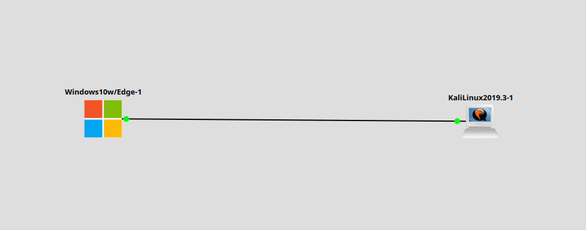
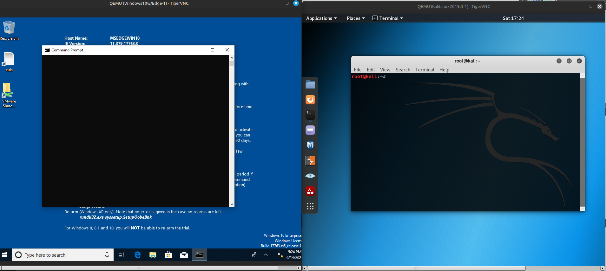
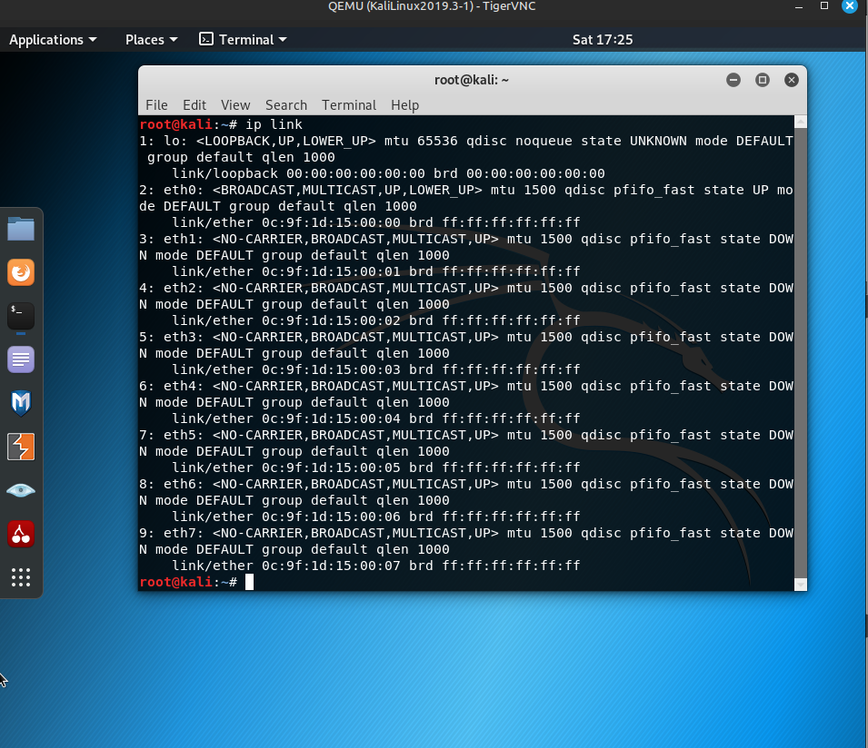
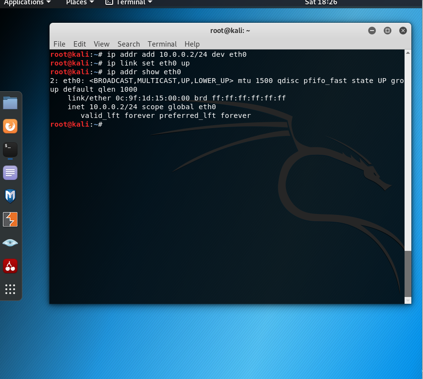
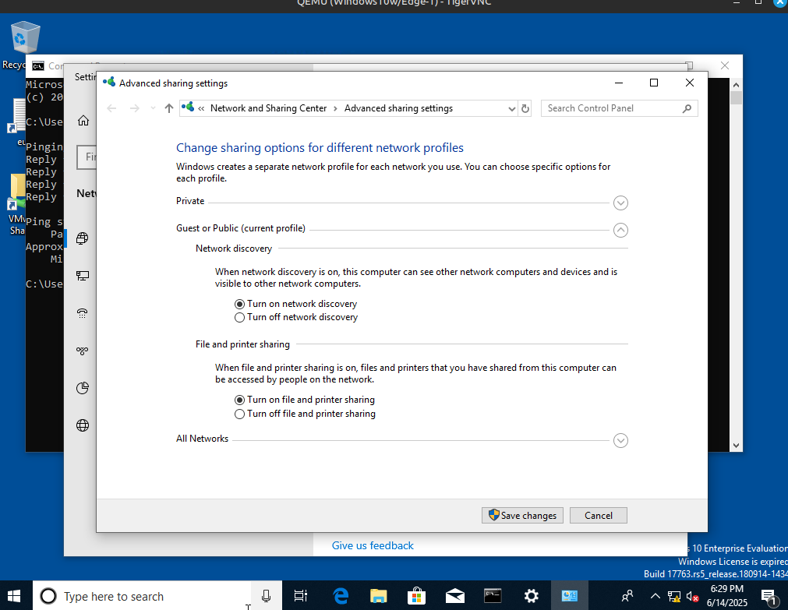
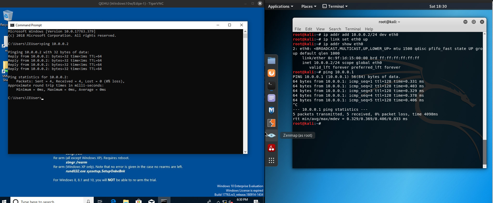

# Заметки к Lab 2 — Прямая связь между Windows 10 и Kali Linux

## Что сделано:
- Создана простая топология в GNS3 с двумя ОС: Windows 10 <-> Kali Linux.
- Соединил напрямую интерфейсы без использования коммутатора.

***

- Назначил IP-адреса:
  - Windows 10: `10.0.0.1/24`
  - Kali Linux: `10.0.0.2/24`
 

***

***

  
- Пинг между системами:
  - `ping 10.0.0.2` с Windows прошёл успешно.
  - `ping 10.0.0.1` с Kali не проходил сначала — на Windows был отключён входящий ICMP.
  - Включил ICMP в настройках брандмауэра Windows (входящие правила).
  - После этого пинги в обе стороны успешны.

***

## Выводы:
- Для прямого подключения достаточно Ethernet-соединения и IP в одной подсети.
- Без маршрутизатора устройства всё равно могут общаться, если находятся в одной подсети.
- Windows по умолчанию блокирует входящий ICMP, нужно разрешать вручную.
- Проверка `ping` на обеих системах успешно.

