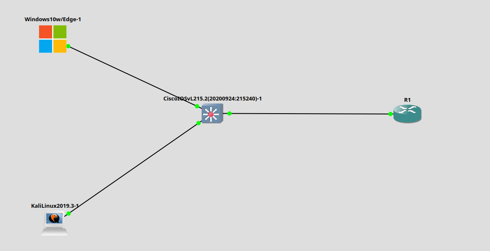
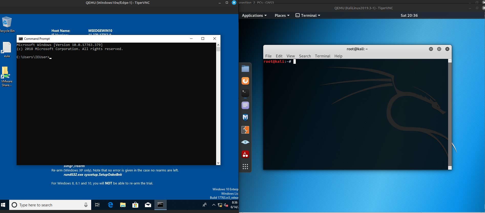
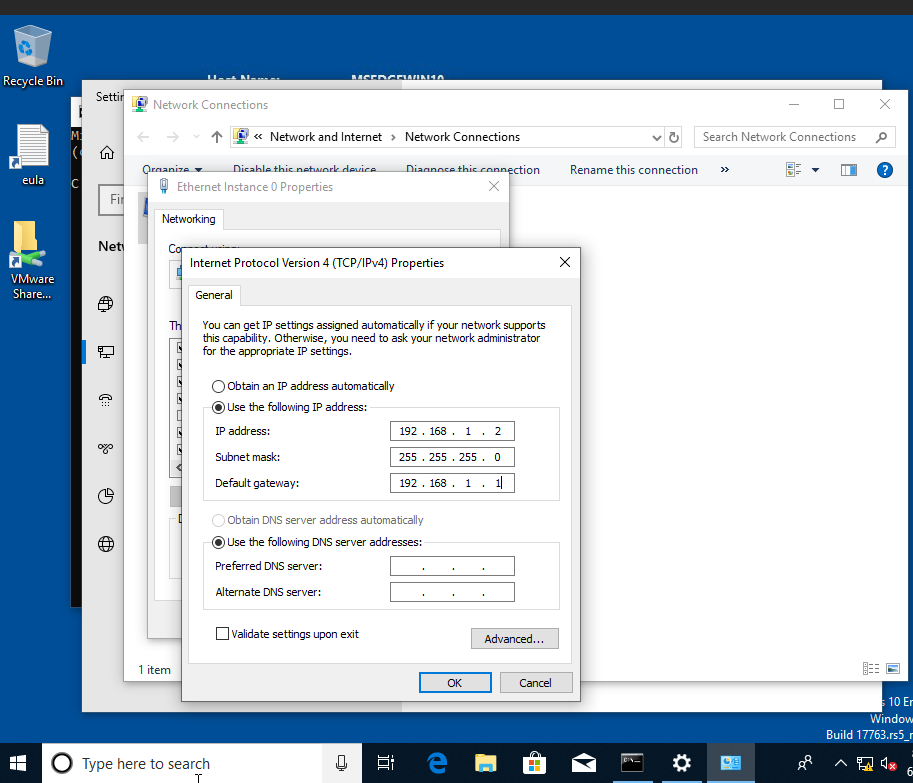
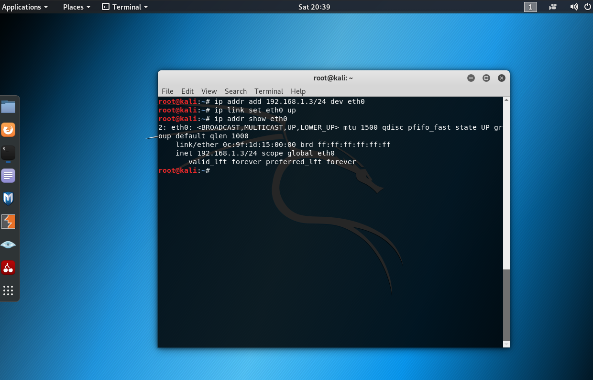
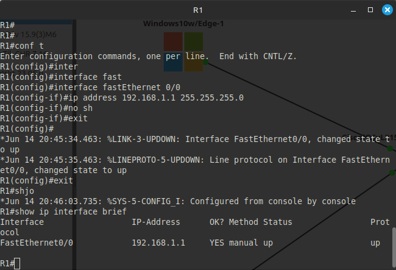
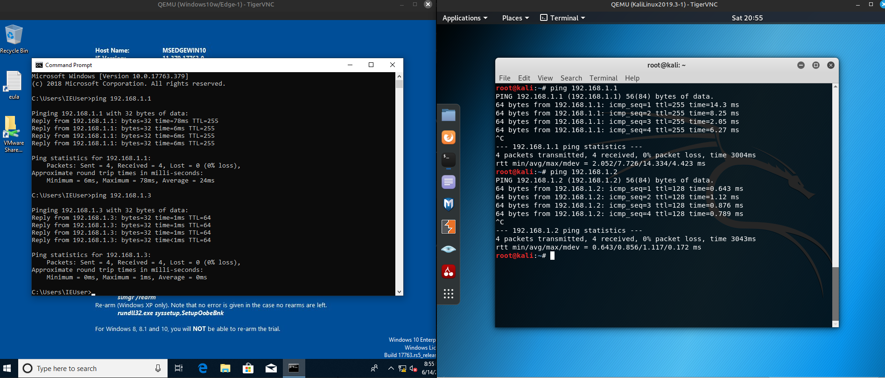

# Lab 3 — Шлюз по умолчанию (GNS3: Windows 10, Kali Linux, Cisco Router)

## Что сделано:

### 1. Топология
- Windows 10 (Ethernet0) -> G0/1 на Switch0  
- Kali Linux (Ethernet0) -> G0/2 на Switch0  
- Switch0 -> Fa0/0 на Router0



***



### 2. Настройка IP-адресов
#### Windows 10:
- IP: `192.168.1.2`
- Маска: `255.255.255.0`
- Шлюз: `192.168.1.1`

**Как настраивалось:**

Панель управления -> Сеть и Интернет -> Центр управления сетями -> Изменение параметров адаптера -> Свойства Ethernet -> Протокол TCP/IPv4 -> Задать IP вручную



#### Kali Linux:
```bash
sudo ip addr add 192.168.1.3/24 dev eth0
sudo ip route add default via 192.168.1.1
```



### 3. Настройка маршрутизатора (Router0)

Команды в CLI:
```bash
enable
configure terminal

interface FastEthernet0/0
ip address 192.168.1.1 255.255.255.0
no shutdown
exit
```



### 4. Проверка связности

- ping 192.168.1.1 с Windows - успешно
- ping 192.168.1.1 с Kali - успешно
- ping с Windows на Kali - успешно
- ping с Kali на Windows - успешно



### Выводы

- Устройство передаёт трафик вне подсети через шлюз (default gateway).
- Правильная настройка IP + шлюза на конечных хостах обязательна.
- При первом ping создаётся ARP-запрос - можно видеть его в Wireshark.
- На маршрутизаторе нужен no shutdown на интерфейсе, иначе он будет в administratively down.
