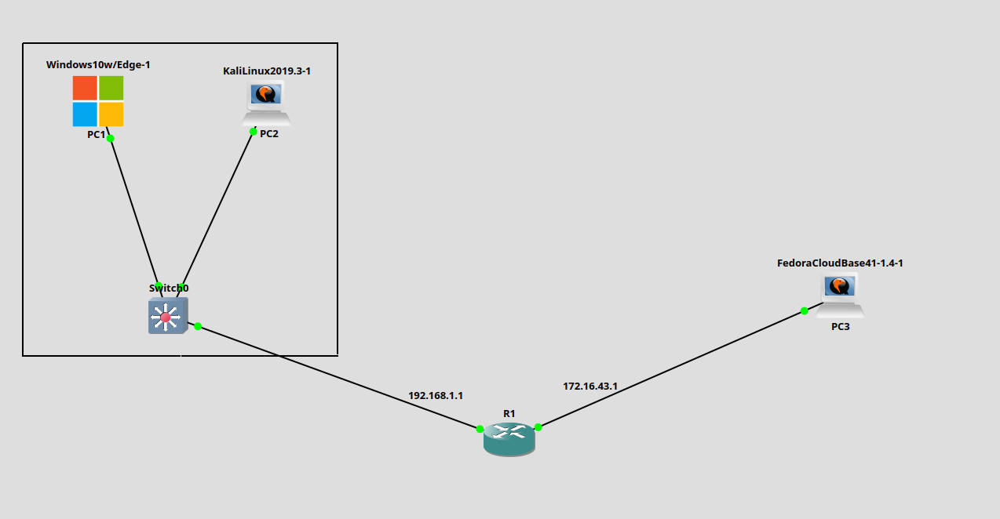
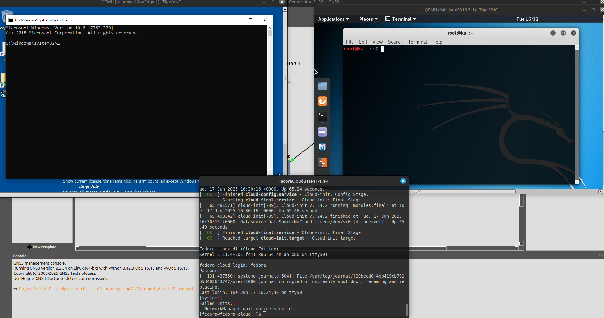
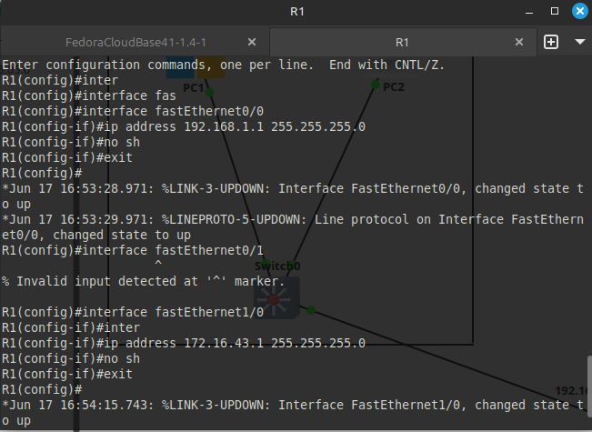
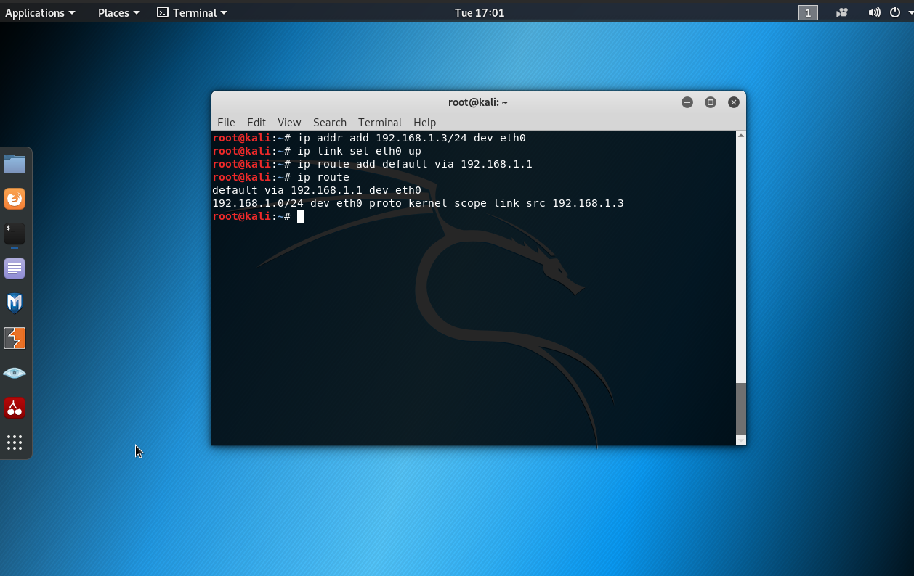
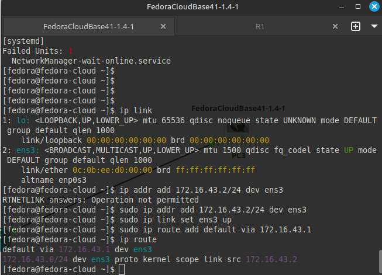
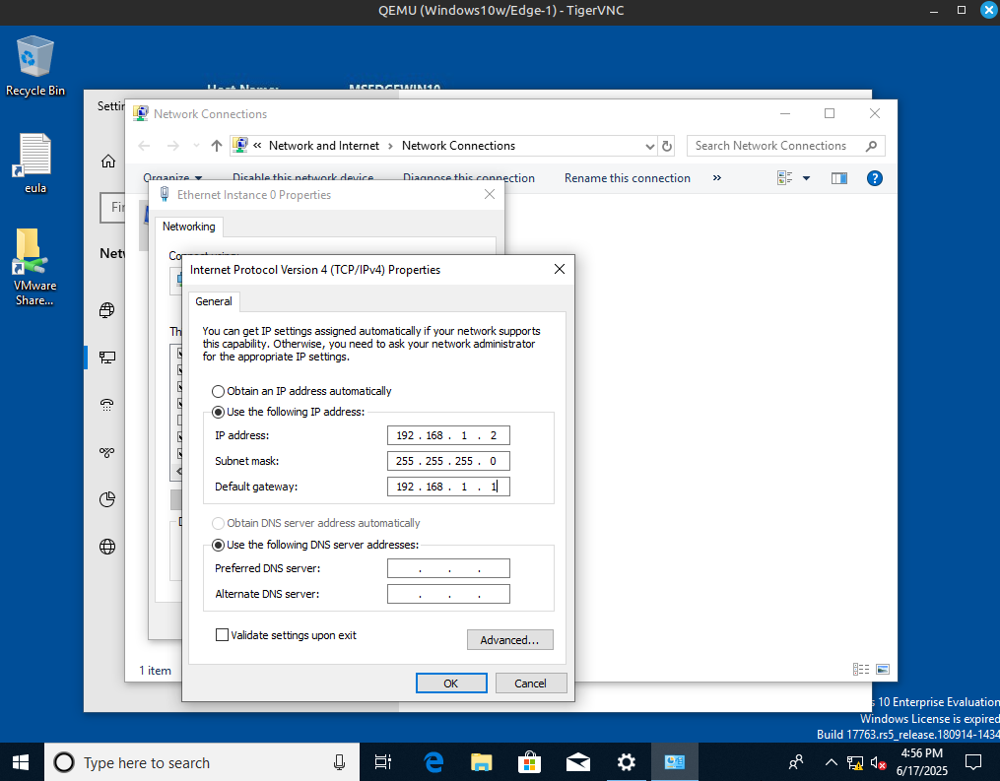
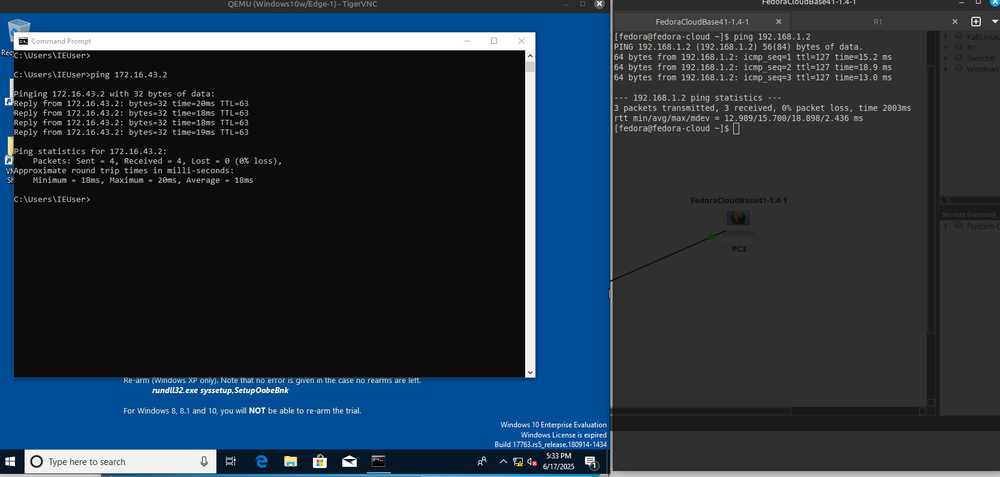
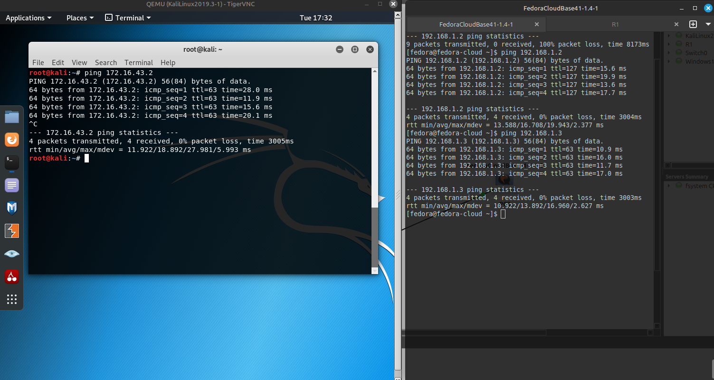

# Заметки к Lab 4: Связь между двумя подсетями

## Что сделано:

- Собрана топология:
  - Windows и Kali в одной подсети (192.168.1.0/24) через Switch.
  - Fedora Cloud Base — в другой подсети (172.16.43.0/24) напрямую к маршрутизатору.
- Назначены IP-адреса и шлюзы вручную.
- Настроен маршрутизатор R1 для маршрутизации между интерфейсами.
- Проверена связность между устройствами с помощью `ping`.



* * *



---

## Конфигурация R1:

```bash
enable
configure terminal

interface FastEthernet0/0
 ip address 192.168.1.1 255.255.255.0
 no shutdown

interface FastEthernet1/0
 ip address 172.16.43.1 255.255.255.0
 no shutdown
```



---

## Конфигурация Kali Linux:

```bash
ip addr add 192.168.1.3/24 dev eth0
ip link set eth0 up
ip route add default via 192.168.1.1
```



---

## Конфигурация Fedora Cloud Base:

```bash
sudo ip addr add 172.16.43.2/24 dev ens3
sudo ip link set eth0 up
sudo ip route add default via 172.16.43.1
```



---

## Конфигурация Windows:

- IP: 192.168.1.2, маска: 255.255.255.0
- Шлюз: 192.168.1.1
- Задано через свойства сетевого адаптера.



---

## Результат



---



* * *

## Выводы

- Подсети не могут общаться напрямую — требуется маршрутизатор.
- IP-адреса и шлюзы должны быть правильно указаны для успешной маршрутизации.
- Если шлюз не указан — ПК не знает, куда отправлять пакеты за пределами подсети.
- Fedora Cloud Base требует ручного поднятия интерфейса и маршрута.
