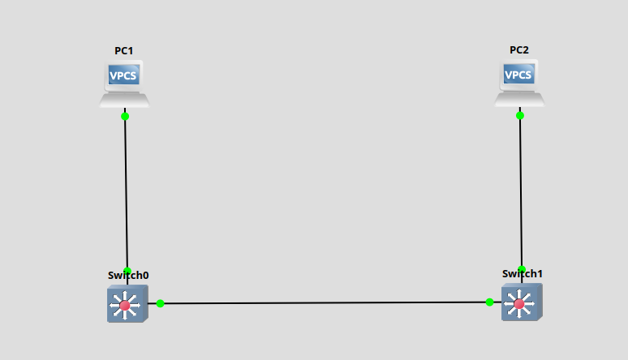
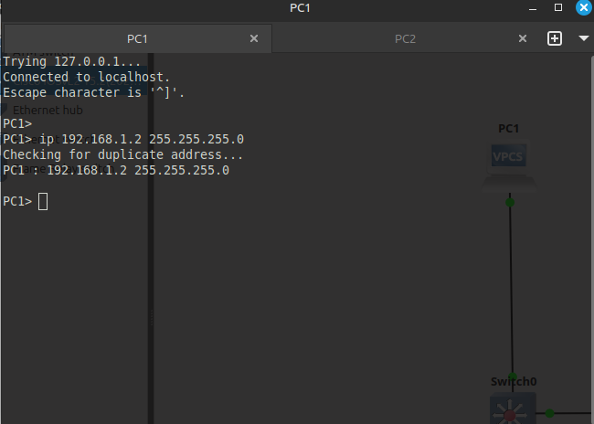
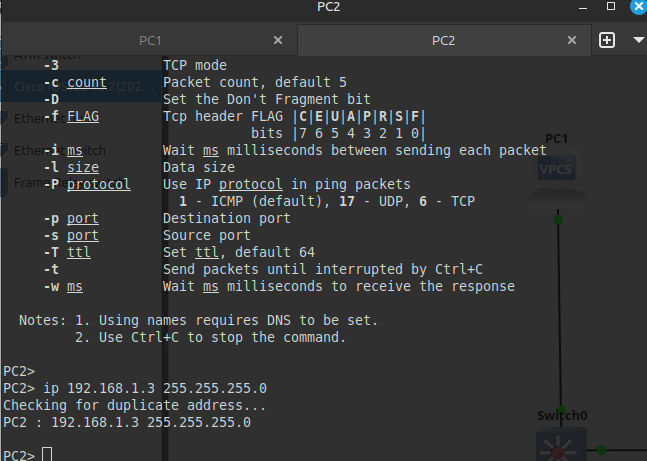
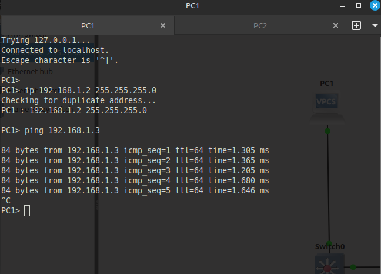
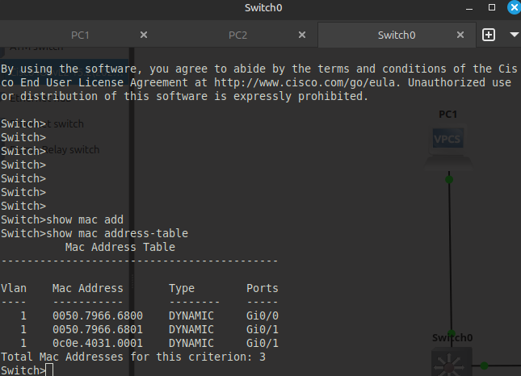

# Заметки к Lab 5: Соединение нескольких коммутаторов

## Что сделано:
- Созданы два коммутатора Switch0 и Switch1.
- Связаны порты FastEthernet0/24 на обоих коммутаторах.
- Подключены ПК1 к Switch0 (G0/1), ПК2 к Switch1 (G0/1).
- Назначены IP-адреса ПК1: 192.168.1.2/24, ПК2: 192.168.1.3/24.
- Проверена связь с помощью команды ping от ПК1 к ПК2 — ответ получен успешно.

* * * 

* * * 

* * * 

* * * 

* * * 

## Выводы:
- Коммутаторы автоматически учат MAC-адреса и корректно передают трафик между портами.
- Связь между ПК через несколько коммутаторов возможна при корректной настройке.
- Значение правильного подключения и назначения IP-адресов в одной подсети.
