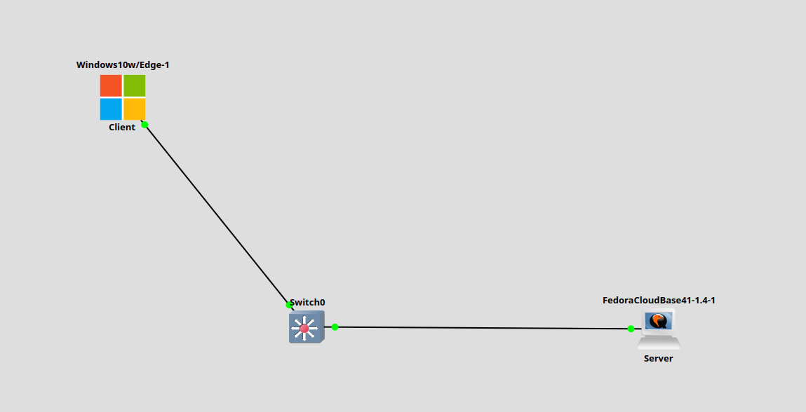
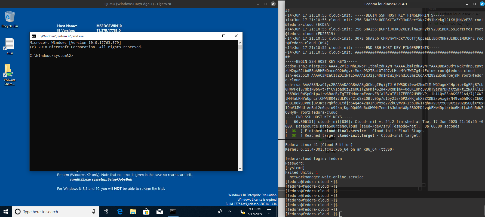
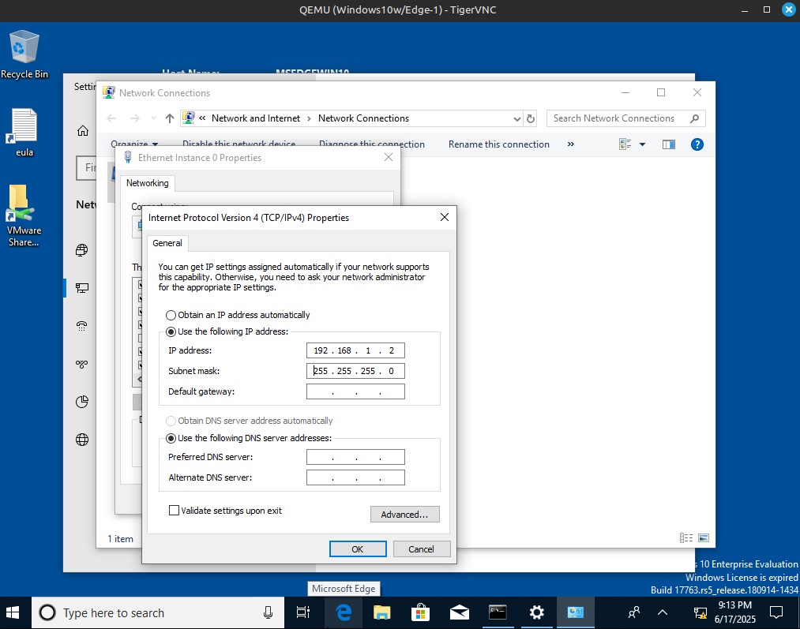
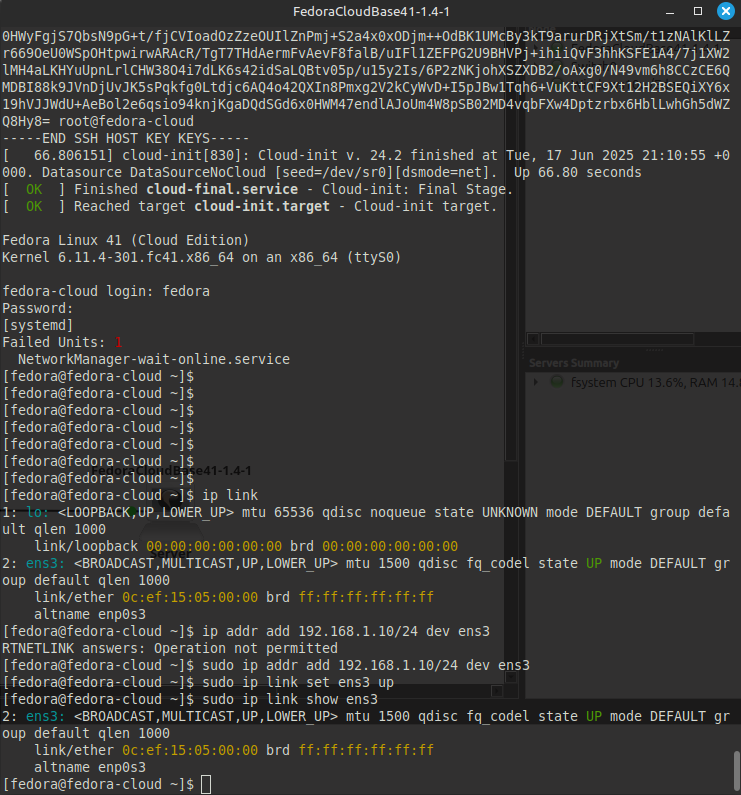
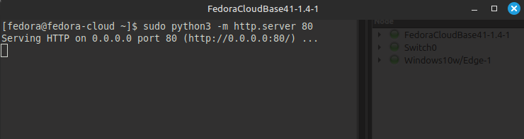
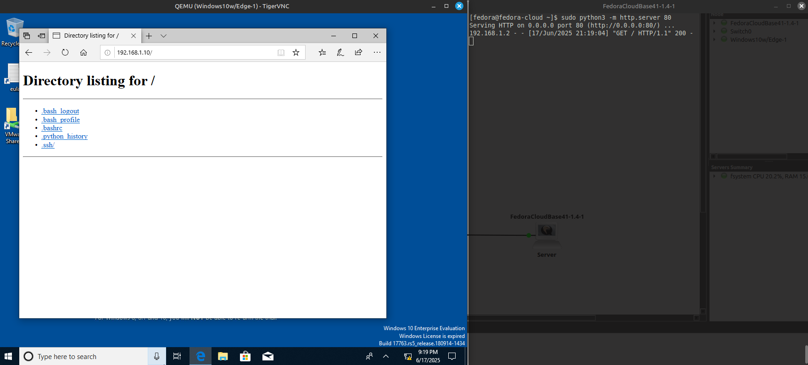

# Заметки к Lab 6 - Подключение ПК к серверу в локальной сети

## Что сделано:

- Создана локальная сеть: Windows 10 (клиент) ↔ Fedora Cloud (сервер) через Switch.



---



- Назначены IP-адреса:
  - Windows 10: 192.168.1.2/24
  - Fedora Cloud: 192.168.1.10/24



---



---


- Проверена базовая связность с помощью команды `ping` — пакеты успешно доходят.
- На Fedora-сервере запущен встроенный HTTP-сервер:
  ```bash
  sudo python3 -m http.server 80
  ```



---

- Сервер начал прослушивать порт 80:
- С Windows-клиента выполнен запрос в браузере по адресу http://192.168.1.10.
- На сервере появилось сообщение о входящем подключении:



***
## Выводы

- Сервер Fedora успешно принимает входящие HTTP-запросы от клиента.
- Простейшее клиент-серверное взаимодействие работает сразу после назначения IP.
- Сервер отображает лог подключения - видно IP клиента, дату и метод запроса (GET / HTTP/1.1).
- Для демонстрации достаточно встроенных инструментов без установки Apache или Nginx.
