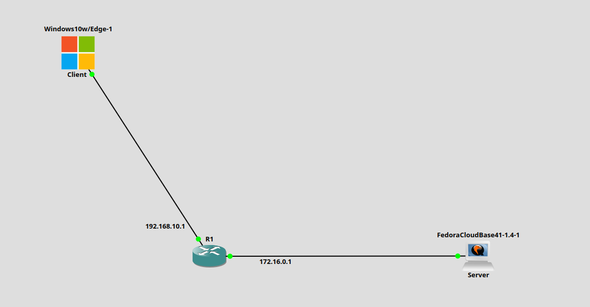
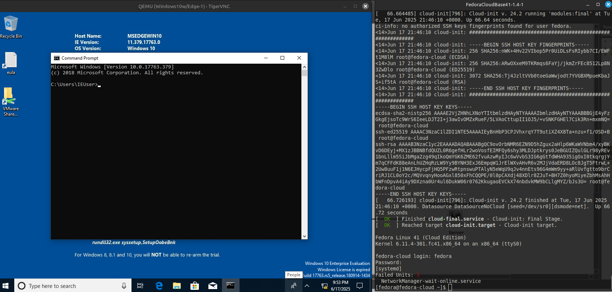
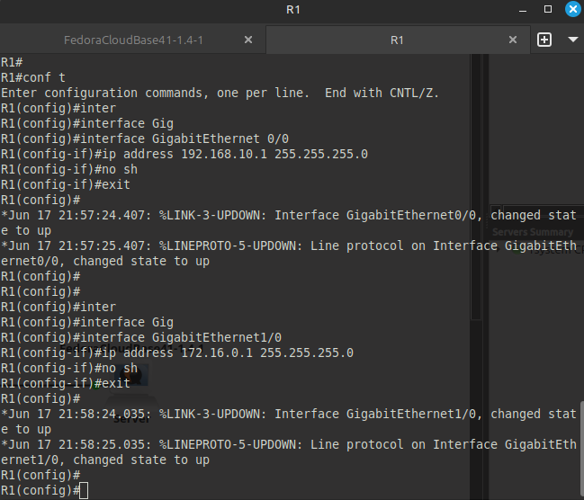
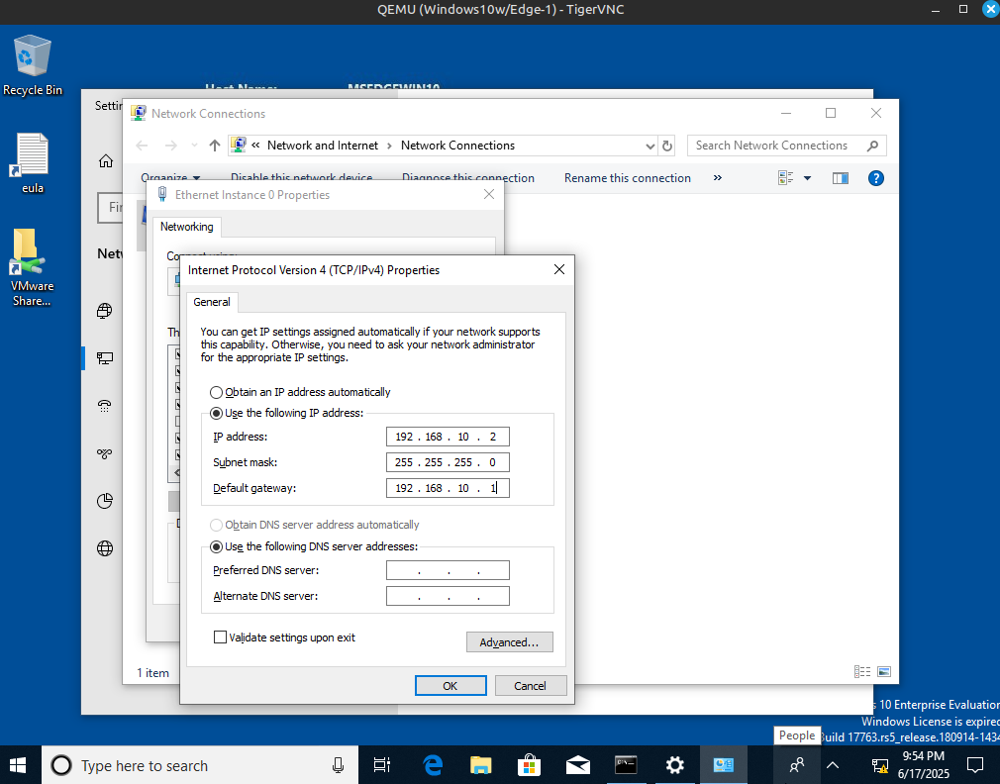
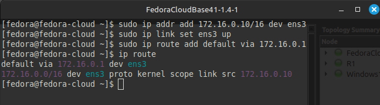
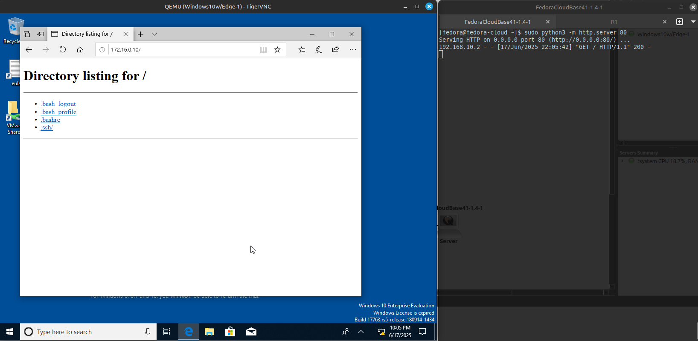

# Lab 7 — Связь между двумя подсетями через маршрутизатор

## Что сделано:

- Построена сеть с двумя подсетями:
  - Подсеть 1: Windows-клиент — `192.168.10.2/24`, шлюз — `192.168.10.1`
  - Подсеть 2: Fedora-сервер — `172.16.0.10/16`, шлюз — `172.16.0.1`
- Устройства подключены через маршрутизатор:
  - `Router0`:
    - Интерфейс G0/0 — к Windows, IP: `192.168.10.1/24`
    - Интерфейс G0/1 — к Fedora, IP: `172.16.0.1/16`



---




- Назначены статические IP-адреса и шлюзы.
- Проверена связь (ping, http).

## Настройка оборудования

### Router0 (Cisco IOS)

```bash
enable
configure terminal

interface GigabitEthernet0/0
 ip address 192.168.10.1 255.255.255.0
 no shutdown

interface GigabitEthernet1/0
 ip address 172.16.0.1 255.255.0.0
 no shutdown
```



---

### Windows (Client)

Ручная настройка IP:

- IP-адрес: 192.168.10.2
- Маска: 255.255.255.0
- Шлюз: 192.168.10.1




---

### Fedora Cloud Base (Server)

```bash
sudo ip addr add 172.16.0.10/24 dev ens3
sudo ip link set ens3 up
sudo ip route add default via 172.16.0.1
```



---

## Проверка HTTP-соединения

- На сервере запущен http-server(172.16.0.10)
- Клиент (Windows) успешно подключился
- На сервере отобразился лог



---

## Выводы

- Маршрутизатор необходим для связи устройств, находящихся в разных подсетях.
- Статическая маршрутизация и правильная настройка IP-адресов позволяют обеспечить полную связность сети.
- Шлюз по умолчанию обязателен на конечных устройствах для выхода за пределы своей подсети.
- Fedora Cloud можно использовать как полноценный сервер (например, HTTP) в тестовой среде.
- Простой python3 -m http.server позволяет проверить доступность сервиса на уровне приложений, а не только сети.
