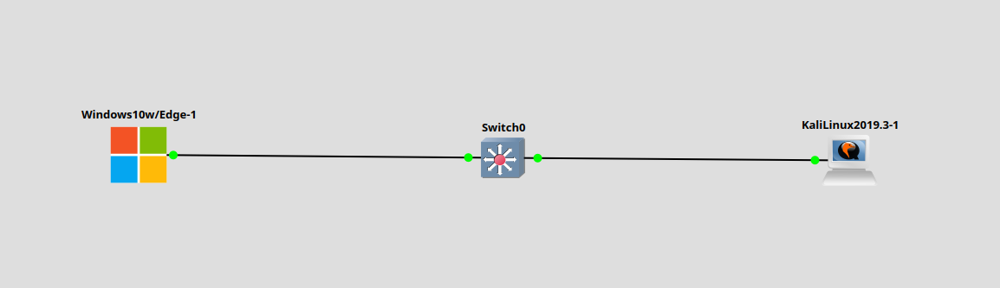
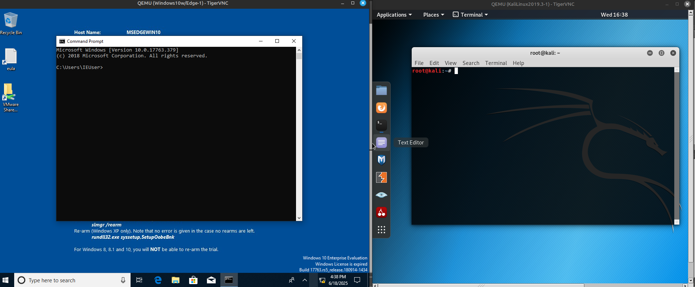
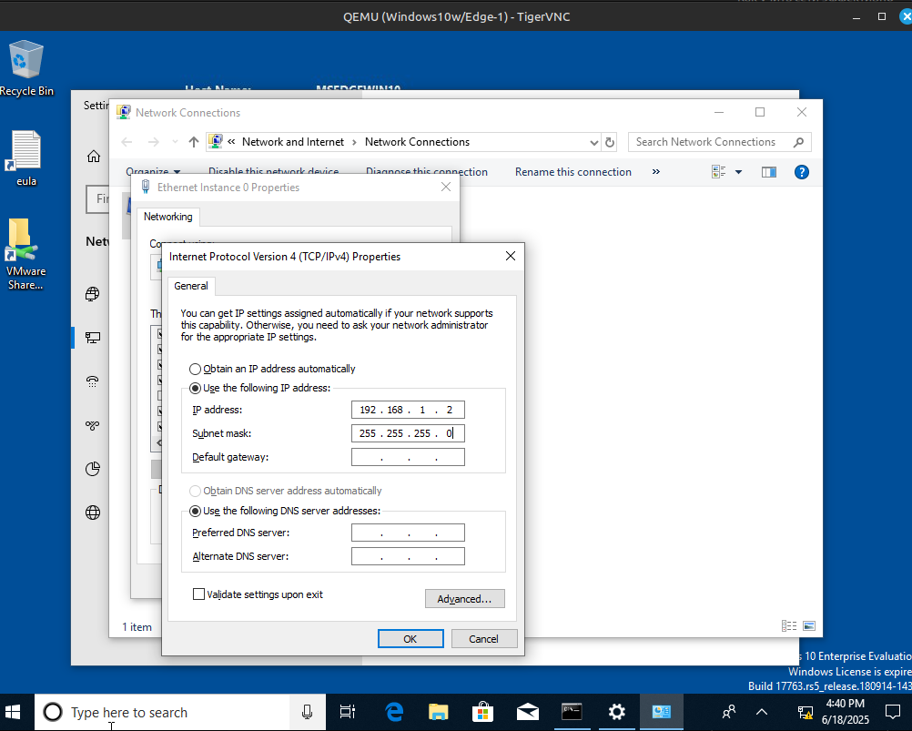
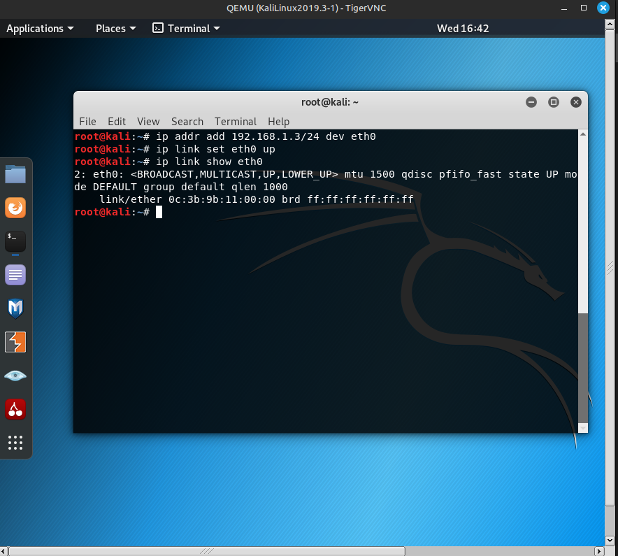
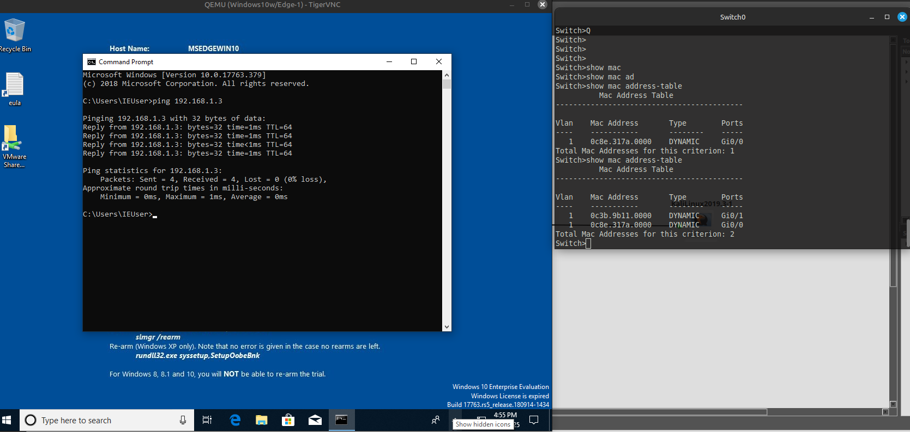

# Заметки к Lab 8 - Проверка таблицы MAC-адресов

## Что сделано:
- Подключил Windows 10 и Kali Linux к Cisco коммутатору.



* * *



- Назначил IP-адреса:
  - Windows: 192.168.1.2/24
  - Kali: 192.168.1.3/24



* * *



- Проверил связь командой `ping` с Windows → Kali — ответ получен.
- Перешёл на Switch и выполнил:
``` show mac address-table ```

Увидел 2 MAC-адреса, каждый привязан к соответствующему порту (G0/0 и G1/0).



## Выводы
- Коммутатор автоматически добавляет MAC-адреса в таблицу после первого трафика.
- `ping` помогает не только проверить соединение, но и инициировать обучение MAC-таблицы.
- Таблица очищается по таймеру, если нет активности.
