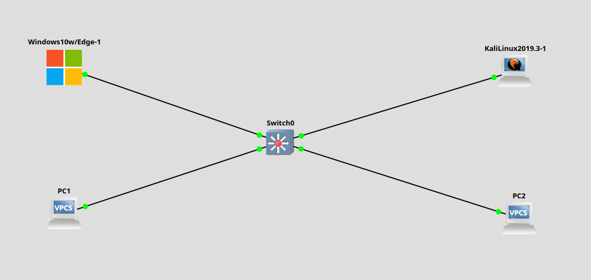
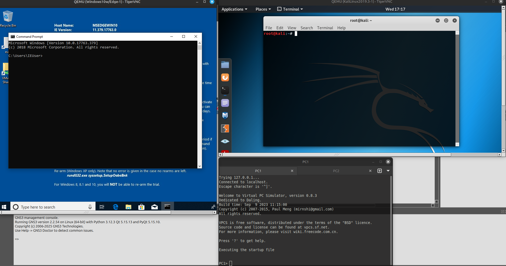
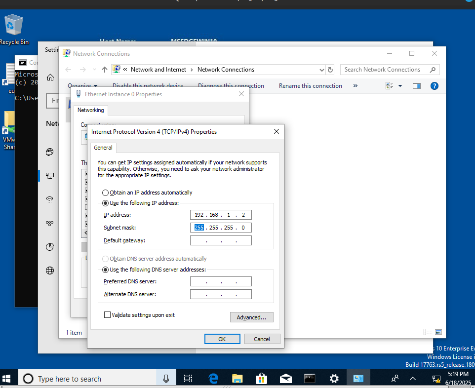
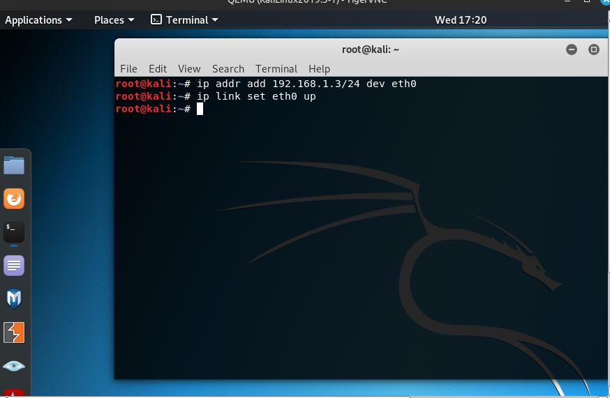
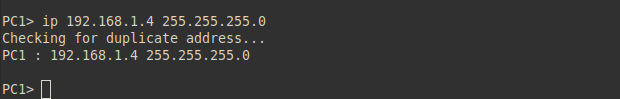
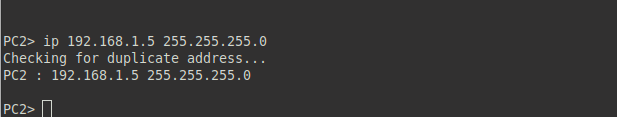
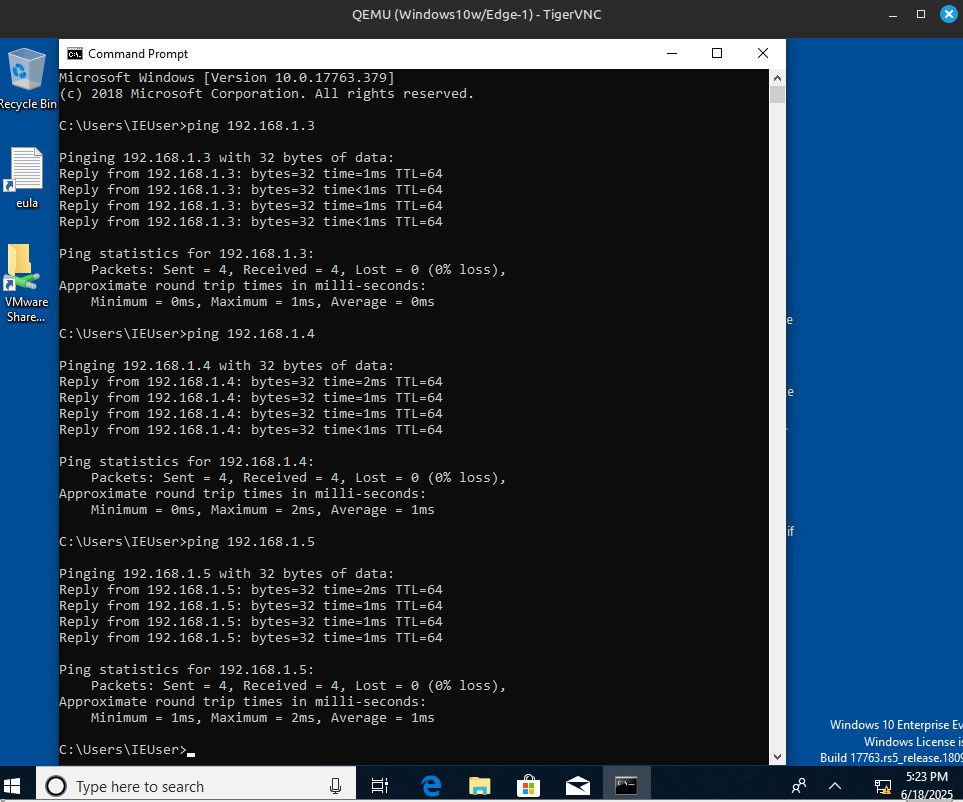

# Заметки к Lab 9 - Масштабирование сети с несколькими ПК

## Что сделано:
- Построена топология: ПК1 (Windows), ПК2 (Kali), VPCS1, VPCS2 — все подключены к Switch0.



* * * 



- Назначены IP-адреса в одной подсети /24:
  - Windows: 192.168.1.2
  - Kali: 192.168.1.3
  - VPCS1: 192.168.1.4
  - VPCS2: 192.168.1.5



* * *



* * *

## Настройка VPCS:
``` ip 192.168.1.4 255.255.255.0 192.168.1.1 ```



* * *




- Выполнен ping с ПК1 на остальные ПК - успешно.




## Выводы:
- Все устройства корректно обмениваются данными в пределах одной подсети.
- Коммутатор автоматически обработал MAC-адреса и направил трафик к нужным портам.
- Связь между Windows, Kali и VPCS прошла без проблем.
- Убедился в стабильной работе локальной сети при увеличении количества хостов.
