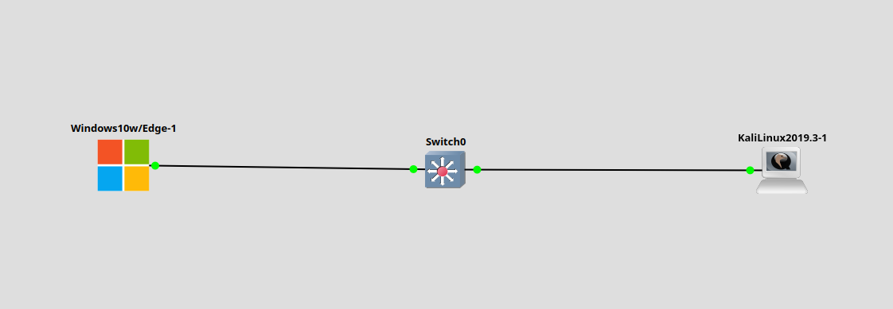
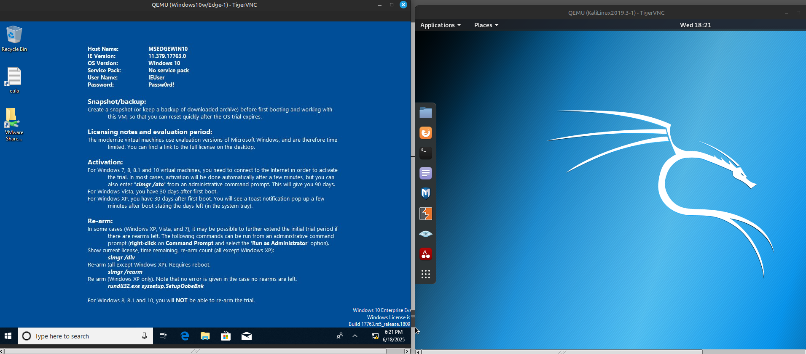
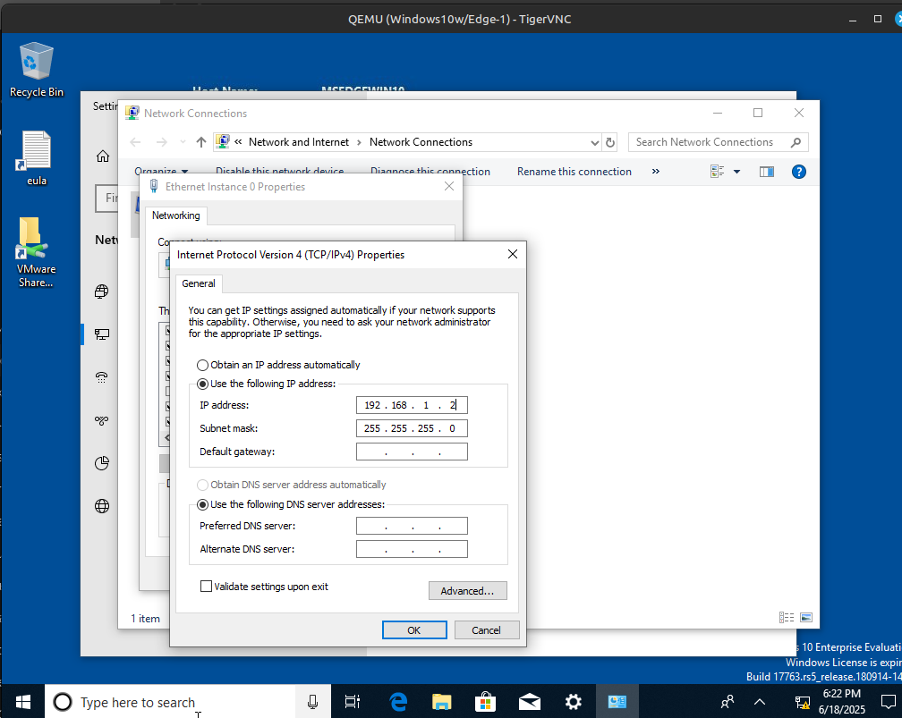
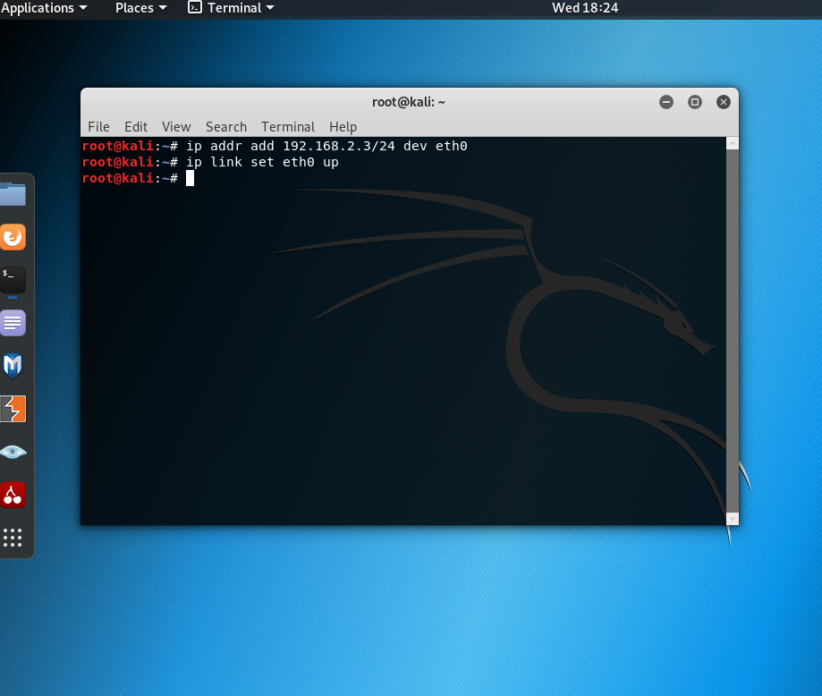
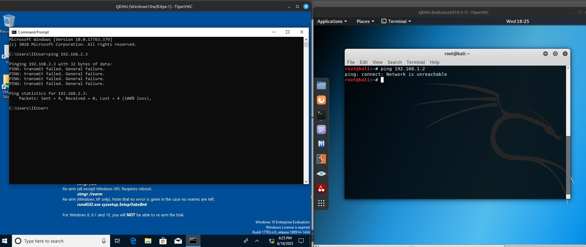
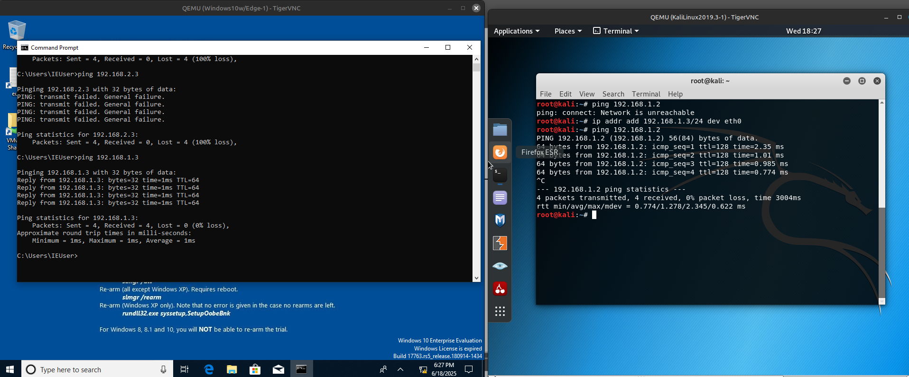

# Заметки к Lab 10: Ошибки IP-адресации

## Что сделано:
- Создана сеть: ПК1 (Windows), ПК2 (Kali), соединены через Switch0.

* * *

- Назначены IP:
  - ПК1: 192.168.1.2/24
  - ПК2: 192.168.2.3/24 (ошибочная подсеть)

* * *

- Выполнен ping с ПК1 на 192.168.2.3 — неудача.

- Выполнен анализ:
  - Проверена IP-конфигурация (ipconfig / ifconfig).
  - Проверена таблица ARP — MAC-адрес не определился.
- Исправлен IP-адрес ПК2: 192.168.1.3/24.
- Повторный ping прошёл успешно.

## Выводы:
- Устройства в **разных подсетях** не могут взаимодействовать напрямую без маршрутизатора.
- Ошибки IP-адреса легко выявляются через `ping` и `arp -a`.
- Диагностика — важный навык при настройке сетей.

## Что можно сделать дополнительно:
- Добавить Wireshark для анализа ARP-запросов.
- Проверить MAC-таблицу коммутатора (`show mac address-table`, если это Cisco).
- Создать аналогичную ситуацию, но с ошибочной маской, например /16 вместо /24.
